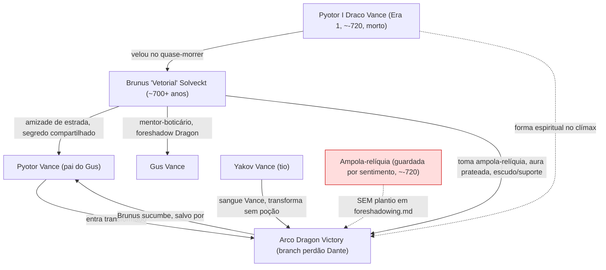
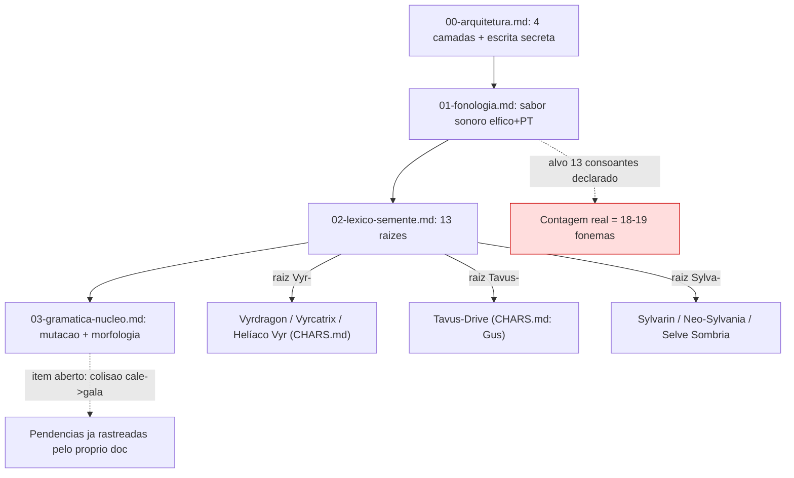

# TEXTREVIEW incremental — Brunus Vetorial + pacote conlang Sylvarin

**Data:** 2026-07-06. **Executor:** `revisor-textual` (protocolo `TEXTREVIEW.md` v2), modo READ-ONLY.
**Origem:** `AUDITORIA-COMPLETA-2026-07-06`, achado **AC-L5** (`TODO.md:382`, `ORIENTACOES.md:168-174`) — piloto TEXTREVIEW incremental nunca rodado nestes docs canonizados após os audits T1-T10.
**Status:** achados reportados. Nenhuma edição aplicada nos arquivos-alvo (dispatch é lente de detecção, não de edição). Correções de prosa, se aprovadas, seguem via `narrative-writer` (regra `feedback_deep_lore_sempre_narrative_writer`).

Cross-ref usado: `TEXTREVIEW.md`, `CHARS.md`, `PLACES.md`, `docs/narrative/timeline.md`, `docs/narrative/INCOHERENCES.md`, `docs/narrative/foreshadowing.md`, `docs/design/pillars.md`, `README.md`, memória `project_dragon_victory_canon`.

---

## LOTE 1 — `brunus-vetorial.md` (~3885 pal) + `brunus-vetorial-conto.md` (~1086 pal)

Processado como janela única (ambos docs cabem em ~1 janela e meia de 1000+200; tratados coesos por serem ficha+conto do mesmo personagem, conforme a lógica de lote do dispatch).

### 1. Texto Revisado (amostras pontuais — não é reescrita integral; ver §2 para lista completa de intervenções)

- `brunus-vetorial.md:89` — **Antes:** "que soam metáfora ao Gus mas são literais" → **Depois:** "que soam **como** metáfora ao Gus mas são literais" (regência do verbo "soar").
- `brunus-vetorial.md:113` — **Antes:** "o Flaw que o define desde o velório de Pyotor I, se rompem uma única vez" → **Depois:** "o Flaw que o define desde o velório de Pyotor I, se rompe uma única vez" OU reescrever o núcleo do sujeito para "A regra de 'some nos momentos-chave' ... se rompe uma única vez" (concordância + clareza referencial — "anos... se rompem" é semanticamente estranho, mesmo com concordância gramatical tecnicamente correta).
- `brunus-vetorial.md:135` — frase mestra do fechamento do círculo é excessivamente encaixada ("agora é o descendente dele, médico como o próprio ofício de cuidar não esqueceu de ser, quem o vela outra vez..."); sugestão: "agora é o descendente dele, médico que nunca esqueceu o próprio ofício de cuidar, quem o vela outra vez..." (elimina o anacoluto leve).
- `brunus-vetorial.md:174` e `brunus-vetorial-conto.md:15` — **Antes:** `diz só: "você é teimoso demais..."` → **Depois:** `diz só: "Você é teimoso demais..."` (capitalizar início de fala completa após dois-pontos; ocorre nas duas instâncias da mesma citação, cross-doc).
- `brunus-vetorial.md:117` — "é salvo por Pyotor Vance" e trecho irmão (linha 135, "É salvo por Pyotor Vance, médico-cyber itinerante, pai do Gus.") em voz passiva no beat dramático mais alto do arco. Sugestão ativa: "Pyotor Vance, médico-cyber itinerante, pai do Gus, o salva." (protocolo §12, voz ativa em sequência de ação/clímax).

### 2. Relatório de Intervenção Gramatical/Estilística

- **Regência (MÉDIO):** `brunus-vetorial.md:89` "soam metáfora" sem preposição — corrigir para "soam **como** metáfora" (mais natural que "soam **à** metáfora", que crase mal com valor idiomático diferente).
- **Concordância/clareza referencial (MÉDIO):** `brunus-vetorial.md:113` sujeito duplo (Setecentos anos / o Flaw) com verbo no plural concordando com o substantivo "errado" semanticamente (não se "rompe" um número de anos, rompe-se um padrão/regra).
- **Sintaxe encaixada (MÉDIO):** `brunus-vetorial.md:135` frase com 3 orações relativas aninhadas dificulta leitura em voz alta (o texto é destinado a virar roteiro/cutscene); recomendo quebrar em 2 frases.
- **Voz passiva em clímax (MÉDIO, protocolo §12):** linhas 117 e 135 (mesmo evento, "é salvo por Pyotor Vance"). Reescrever ativo nas duas ocorrências (cross-doc consistente, mesma correção nas duas).
- **Capitalização pós dois-pontos em fala direta (LEVE):** `brunus-vetorial.md:174` e `brunus-vetorial-conto.md:15`, mesma citação ("você é teimoso demais..."), ambas em minúscula após os dois-pontos. Padronizar maiúscula nas duas (consistência cross-doc já existe no erro, então o fix é uma correção única replicada).
- **Pronome ambíguo (LEVE):** `brunus-vetorial-conto.md:21` "os anos da reconstrução depois **dele**" — "dele" concorda em gênero com "silêncio" (masc.) mas a proximidade com "Pyotor" (também masc., mencionado antes) cria ambiguidade momentânea de leitura. Sugestão: "depois **disso**" (neutro, remove ambiguidade).
- **Pontuação (LEVE):** `brunus-vetorial-conto.md:25` vírgula antes de "e escrevia" em enumeração ("não envelhecia, e escrevia e pensava") quebra o paralelismo da lista; remover a vírgula antes do primeiro "e".
- Fora esses pontos, ambos os docs estão **limpos**: zero em-dash, zero palavrão não-censurado, zero termo da lista negra, acentuação/cedilha 100% presentes (checado por grep dedicado — nenhum falso "nao/voce/ja/lider" sem acento), formatação de diálogo (quando ocorre) não usa hífen no lugar de travessão. Cadência de frase (75/25 longas/curtas) respeitada, inclusive com uso deliberado de frases curtas para ênfase ("Não é conjuro; é corpo.", "Só ali. Só então.").

### 3. Relatório de Inconsistências de Cânone

- **[CRÍTICO — decisão do líder] Atribuição de inspiração real desalinhada com o README.** `brunus-vetorial.md:9` e `CHARS.md:85` afirmam "Inspirado pelo amigo real Bruno Vettore (agradecimentos do README)". Conferido `README.md:216`: o agradecimento existente a Bruno Vettore é **apenas** sobre a sugestão de criar a **língua** Sylvarin ("deu a sugestão de criar uma língua para o jogo... O Sylvarin nasceu daí"), não sobre o personagem Brunus. Hoje não existe no README nenhuma linha creditando Bruno Vettore como inspiração do **personagem**. Isso é uma referência cruzada que aponta pra uma fonte que não diz o que o char-doc afirma que ela diz. **Precisa decisão do líder:** (a) adicionar uma linha própria no README creditando a inspiração do personagem Brunus, ou (b) corrigir o char-doc/CHARS.md pra não citar "agradecimentos do README" como a fonte dessa atribuição específica (manter só na dedicatória do conto, que já é auto-suficiente: "Para Bruno Vettore, que inspirou este homem"). Sem tocar em README/CHARS agora — reportando pra decisão.
- **[CRÍTICO — lacuna de causalidade, protocolo §10] Ampola-relíquia sem plantio prévio em `foreshadowing.md`.** A ampola que Brunus usa no clímax (transformação prateada) é o objeto mecânico central do sacrifício dele, mas não existe **nenhuma entrada** em `docs/narrative/foreshadowing.md` plantando esse objeto antes do clímax (busca confirmada: zero ocorrências de "ampola" ligadas a "Brunus" no arquivo de foreshadowing; o arquivo tem entradas F063/F093 pra outras ampolas, mas nenhuma pro item do Brunus). Sem um plant ambient (ex.: um frasco trancado na botica que ele nunca abre, uma menção que os companions notam e perguntam, um DD in-world), o reveal no clímax roda risco real de "deus ex machina" pelo critério do próprio protocolo (§10, "ausência de plantio prévio gera quebra crítica de causalidade"). Recomendo abrir item de foreshadow formal (F-novo) quando o arco do clímax for roteirizado — reportando como achado, não como fix aplicado.
- **[VALIDADO, sem contradição] Idade dos ~700 anos do Brunus bate com a cronologia canônica.** `PLACES.md:90` (Castelo Vance) fixa "último uso ~-720" pro cerco em que Pyotor I morreu; ano atual do jogo é 0; logo Brunus tem hoje algo entre ~700-720+ anos, exatamente a faixa "~700+ anos" que o char-doc declara. Cross-referenciado positivamente, nenhuma ação necessária — registrado aqui pra fechar o rastreamento (matriz abaixo).
- **[VALIDADO, sem contradição] Segredo em camadas (Pyotor atual + Gus vs. linhagem inteira no clímax) é consistente.** O doc explicita que só Pyotor atual + Gus sabem antes do clímax, e que no clímax o círculo se abre pra quem "importa" (linhagem presente), mantendo sigilo público. Os 6 companions são explicitamente afastados antes da transformação, então não veem — coerente com "não é revelação pública". Sem furo.
- **[PROCESSO, não é achado de texto] AC-L3 e AC-L4 (do mesmo `ORIENTACOES.md`) já aparentam RESOLVIDOS.** Reli `brunus-vetorial.md:3` (status hoje: "Canônico (revisado pelo criador supremo, 2026-07-03)", sem o texto autocontraditório "rascunho para revisão" citado em AC-L3) e `:164` (cita "pillars.md, princípio anti-dark-gratuito da visão" separado de "e Pillar 4", sem atribuir a frase ao Pillar 4 como AC-L4 descrevia). `git log` confirma commit `b0b8f7b chore(auditoria): AC-E7/E8/L3/L4 - restaura resources, move insumo p/ docs, fixes de header de lore` já cobriu isso. **Sugestão:** o líder pode fechar AC-L3/AC-L4 no `TODO.md` como já resolvidos (não mexi no TODO.md, é o orquestrador que sincroniza).

### 4. Dicionário de Consistência + Matrizes

**Grafias validadas (0 divergência contra CHARS/PLACES/timeline):** Brunus "Vetorial" Solveckt · Pyotor I Draco Vance · Vyrdragon · Pyotor Vance · Yakov Vance · Gus/Gustaf · Jaci "Proxy" Vanderbist · Castelo Vance · Sterling Locke.

**Matriz de Custódia (protocolo §7, restrita a trânsito de objeto):**

| Objeto | Origem | Portador | Estado até o clímax | Transição | Regra de reversibilidade |
|---|---|---|---|---|---|
| Ampola-relíquia (última dose do experimento) | Dia do quase-morrer de Brunus, ~-720 | Brunus (guarda por sentimento, nunca revela) | Inerte 700+ anos, nenhuma facção a caça (sozinha "não faz nada") | Ressoa só na presença do campo de energia dragon da linhagem desperta, no clímax | Não reproduzível (método destruído + esquecido); não é bilocada, sempre com Brunus |
| Objeto herdado do amigo (Pyotor I, pós-morte) | Castelo Vance, ~-720 | Brunus | **TBD** ("objeto a definir em sequel", `brunus-vetorial.md:178`) | — | Em aberto, marcado explicitamente como não-canônico ainda — sem violação, é lacuna assumida |

Nenhuma quebra de cadeia de herança ou bilocação temporal detectada nos dois objetos rastreados.

**Matriz cronológica pontual (Brunus):**

| Evento | Ano aproximado | Fonte cruzada |
|---|---|---|
| Experimento + quase-morte + velório Pyotor I | ~-720 (ou um pouco antes, dentro da janela Era 1 -750/-700) | `PLACES.md:90` (Castelo Vance) |
| Morte de Pyotor I (cerco Castelo Vance) | ~-720 | `PLACES.md:90` + `project_dragon_victory_canon` |
| Idade atual de Brunus (ano 0) | ~700-720+ anos | Consistente com "~700+ anos" do char-doc |

### 5. Diagrama Mermaid (fechamento do lote)

---

## LOTE 2 — pacote `docs/narrative/lingua/` (00-arquitetura, 01-fonologia, 02-lexico-semente, 03-gramatica-nucleo; ~2357 pal somadas)

Tratado como lote único (4 docs individualmente abaixo do gatilho de 1k, juntos acima).

### 1. Texto Revisado (amostras — achado principal é sistêmico, ver §2)

Achado dominante do lote: **os 4 documentos são escritos inteiramente sem acentuação/cedilha/til**, estilo "notas de trabalho ASCII" (ex.: "lingua" por "língua", "lider" por "líder", "matematica" por "matemática", "nao/sao/ja/voce" por "não/são/já/você", "colisoes" por "colisões", "derivacao" por "derivação", "construcao" por "construção", "gramatica" por "gramática", "proximo/proximas" por "próximo/próximas", "ceu"/"arvore" por "céu"/"árvore", "so" por "só", "numero" por "número"). Isso é diferente da prosa canônica típica (lore-bible, timeline, characters/*, que são 100% acentuados) e do próprio Lote 1 (limpo). Amostra de correção:

- `00-arquitetura.md:1` — "Lingua do GusWorld - Arquitetura (espinha dorsal)" → "**Língua** do GusWorld — Arquitetura (espinha dorsal)".
- `00-arquitetura.md:3` — "espinha dorsal APROVADA pelo **lider** 2026-06-23" → "... pelo **líder** ...".
- `01-fonologia.md:1` — "Sylvarin - Fonologia (esqueleto)" → "Sylvarin — Fonologia (esqueleto)".
- `03-gramatica-nucleo.md:39` — "Reversibilidade (resolve **colisoes**)" → "... (resolve **colisões**)".

Dado o volume (o problema é systemic, não pontual), **não** listo aqui as ~80+ ocorrências individuais; recomendo tratar como um único fix de padronização (find/replace assistido + revisão humana pros poucos casos ambíguos, tipo "e" vs "é" dependendo de contexto) via `narrative-writer` ou script de normalização, não token a token.

### 2. Relatório de Intervenção Gramatical/Estilística

- **[MÉDIO, sistêmico] Ausência total de acentuação nos 4 docs.** Pode ser proposital (notas de trabalho em ritmo rápido de brainstorm, todos os 4 docs se autodeclaram "esqueleto"/"proposta"/"aguardando validação" no cabeçalho, nunca "canônico fechado"). Mas o protocolo copydesk (§3.1) exige acentuação obrigatória, e os docs já vivem em `docs/narrative/` (pasta de canon). **Decisão do líder:** manter o estilo rápido-sem-acento enquanto o pacote for "proposta" (documentado como convenção de rascunho), ou normalizar já para acentuação plena agora que o lote está sendo formalmente auditado. Não deduzo sozinho — é o tipo de escolha de estilo/processo que cabe ao criador supremo.
- **[CRÍTICO — inconsistência numérica interna] Inventário consonantal não bate com a contagem-alvo declarada.** `01-fonologia.md:18`: "Demais de apoio: p t c/k b d g f h. Contagem-alvo do inventario consonantal: **13**." Somando tudo que o próprio documento lista como consoante (núcleo l r m n v s = 6; lh nh = 2; th dh = 2; grupo de apoio p t c/k b d g f h = 8, contando c/k como 1 fonema) dá **18** fonemas (19 se c e k forem contados separado) — não 13. Como 13 é also o número-alvo de raízes do léxico (`02-lexico-semente.md`) e claramente carrega a intenção do easter egg Fibonacci (Pillar 2 + `project_fibonacci_easter_egg`), a matemática precisa fechar: ou a lista de consoantes precisa cortar ~5-6 fonemas, ou o alvo "13" precisa ser revisado. Reportando como achado crítico de coerência interna (a doc se autocontradiz em uma contagem que ela mesma declara "rígida, sem exceção", Pillar 2).
- **[MÉDIO — inconsistência de sistema morfológico] Notação de raiz ambígua entre consoante-pura e vogal-embutida.** `02-lexico-semente.md` lista raízes ora terminadas em consoante (`vyr-`, `mor-`, `rime-`, `glyfa-`, `elen-`, `gala-`, `lhin-`, `anh-`, `nenh-`, `ondh-`), ora já com vogal de classe embutida no próprio nome da raiz (`sylva-`, `tavus-`, `cale-`). A regra de derivação "-a substantivo concreto: *sylva* (floresta)" fica circular se `sylva` já É a raiz listada na tabela (não haveria sufixo a aplicar). Mesmo padrão aparece em `03-gramatica-nucleo.md:35`: o exemplo genitivo usa `cala` como forma lenizada de `cale`, mas a lenição documentada é só de consoante inicial (a própria doc reconhece isso e já lista "ver nota" + item pendente "Colisão de lenição (cale->gala vs raiz gala)" — então o autor já sabe do problema, mas a raiz da ambiguidade (notação de raiz inconsistente) ainda não está listada explicitamente entre os "Itens abertos"). Sugiro adicionar essa clarificação (raiz = consoante pura vs. raiz = consoante+vogal-de-classe) à lista de pendências, pra não virar dívida técnica invisível quando o léxico crescer.
- **[LEVE — exemplo morfológico inconsistente] Regra de plural não trata igual raízes terminadas em vogal vs. consoante.** `03-gramatica-nucleo.md:30`: exemplo `sylva -> hylvi` (lenição s→h + troca da vogal final a→i, regular) vs. `tavus -> davsi` (lenição t→d + aparente síncope da vogal interna "u", sem explicação da regra pra esse caso). `nenha -> nenhi` segue o padrão de `sylva` (regular). Recomendo documentar explicitamente a regra pra raízes terminadas em consoante (`tavus`, `anh-`, etc.), hoje só exemplificada, não enunciada.
- Fora esses pontos: zero em-dash, zero termo proibido, zero conflito de nome próprio canônico (Sylva/Vyr/Tavus/Neo-Sylvania/Vyrcátrix todos rastreáveis à grafia certa uma vez os acentos são repostos). Densidade Fibonacci aparentemente intencional e bem alinhada nos números-alvo (**13** raízes, **13** consoantes-alvo, **8** mapeamentos de lenição suave, **5** ditongos) — even that the 13-consoante count is matematicamente incorreto (ver acima), a *intenção* de density Fibonacci está clara e consistente com o canon pervasivo.

### 3. Relatório de Inconsistências de Cânone

- Ver CRÍTICO de contagem consonantal acima (§2) — é ao mesmo tempo um problema gramatical/copydesk e um problema de canon-numérico (a doc promete "tudo regular, sem exceção" — Pillar 2 — e a contagem que ela mesma declara já não fecha).
- Nenhuma divergência contra nomes/lugares/datas do canon central (Sylva, Vyr, Tavus, Neo-Sylvania, Selve Sombria, Ordem Recursiva, C-Arcane, Glyph/Token/Conjuro/Codex todos citados corretamente e coerentes com `lore-bible.md`/`CHARS.md`/`PLACES.md`).
- Processo colaborativo (`feedback_deep_lore_colaborativo_rag_visivel`) parece respeitado: os 4 docs se autodeclaram "proposta"/"aguardando validação"/"esqueleto aprovado", nada se apresenta como canônico fechado sem ressalva — consistente com o workflow de 9 passos.

### 4. Dicionário de Consistência + Matrizes

**Grafias-alvo pós-acentuação (recomendadas, não aplicadas):**

| Como está (sem acento) | Forma correta pt-br |
|---|---|
| lingua | língua |
| lider | líder |
| matematica | matemática |
| gramatica | gramática |
| derivacao / construcao / colisoes | derivação / construção / colisões |
| nao / sao / ja / voce | não / são / já / você |
| numero(s) | número(s) |
| proprio / propria | próprio / própria |
| proximo / proximas | próximo / próximas |
| ceu / arvore / so | céu / árvore / só |

**Matriz de raízes (13 canônicas, conferido total = 13, OK):** sylva-, vyr-, tavus-, nenh-, ondh-, cale-, mor-, rime-, glyfa-, elen-, eryn-, lhin-, anh- — todas cross-referenciadas a termos canônicos existentes (Sylvarin/Neo-Sylvania/Selve, Vyrdragon/Vyrcátrix/Helíaco Vyr, Tavus-Drive, Ordem Recursiva, C-Arcane/cripto-glifo). Nenhuma raiz órfã ou duplicada. **Correção 2026-07-12:** a raiz 11 (listada como *gala-* na data desta auditoria) foi trocada por *eryn-* (sindarin bosque/mata) por conflito com palavrão pt-br, flag do criador; a colisão de lenição cale-> (raiz 11) discutida no achado MÉDIO acima ficou resolvida por *eryn-* ser vogal-inicial.

**Matriz numérica (Fibonacci-alvo declarado vs. real):**

| Métrica | Alvo declarado | Contagem real no texto | Status |
|---|---|---|---|
| Raízes-semente | 13 | 13 (tabela 1-13) | ✅ OK |
| Mapeamentos de lenição suave | 8 | 8 (tabela) | ✅ OK |
| Ditongos | 5 (conjunto fechado) | 5 (ai au ei oi eu) | ✅ OK |
| Inventário consonantal | 13 | 18 (ou 19) | ❌ **não fecha** |

### 5. Diagrama Mermaid (fechamento do lote)

---

## Sumário Final (2 lotes)

| Categoria | Críticos | Médios | Leves |
|---|---|---|---|
| 1. Palavras proibidas | 0 | — | — |
| 2. Nomes trocados | 0 | — | — |
| 3. Cronologia | 0 (validado OK) | — | — |
| 4. Ortografia | — | 1 (sistêmico, lote 2: falta de acentuação nos 4 docs) | — |
| 5. Gramática (regência/concordância/sintaxe) | — | 3 (lote 1: regência §89, concordância §113, sintaxe encaixada §135) | 2 (lote 1: pronome ambíguo, vírgula) |
| 6. Coesão | — | 1 (lote 2: notação de raiz ambígua) | 1 (lote 2: regra de plural não generalizada) |
| 7. Voz autoral | — | 2 (lote 1: voz passiva em beat de clímax, §117/§135) | — |
| 8. Easter eggs | — | — | 0 (densidade Fibonacci intencional e majoritariamente correta) |
| 9. Cross-doc canon | 2 (lote 1: atribuição README/Bruno Vettore + ampola sem plantio em foreshadowing.md) | — | 1 (lote 1: capitalização pós dois-pontos em fala) |
| 9b. Inconsistência numérica interna (lote 2) | 1 (contagem consonantal 13 declarado vs. 18-19 real) | — | — |
| Processo (não é achado textual) | — | — | 1 nota (AC-L3/AC-L4 já resolvidos, sugerir fechar no TODO.md) |

**Totais:** Críticos: 3 (README/Bruno Vettore attribution, ampola sem foreshadow, contagem consonantal) · Médios: 7 · Leves: 4.

**Status:** APROVAR COM FIXES. Nenhum crítico é de palavra proibida/nome trocado/data quebrada (as categorias "bloqueantes" clássicas estão limpas); os 3 críticos encontrados são de natureza **de decisão do líder** (atribuição de crédito real, prioridade de foreshadow, e escolha de fórmula numérica da conlang) — não são erros óbvios de correção automática, então nenhum se qualifica para fix automático em modo `apply-fixes` sem revisão humana.

**Próximos passos sugeridos:**
1. Líder decide os 3 críticos (via AskUserQuestion, um por um ou em bloco).
2. Se aprovado, correções de prosa (regência/voz passiva/capitalização/pronome) via `narrative-writer` (não edição inline).
3. Correção de acentuação do pacote `lingua/` — decidir se normaliza agora ou mantém estilo "rascunho rápido" enquanto proposta.
4. Abrir entrada nova em `foreshadowing.md` pra ampola-relíquia do Brunus quando o arco do clímax for roteirizado (não bloqueia nada agora, mas fica marcado).
5. Líder pode fechar AC-L3/AC-L4 no `TODO.md` (achado de processo, já resolvidos no commit `b0b8f7b`).

**Última nota:** este relatório não altera nenhum arquivo canônico (`brunus-vetorial.md`, `brunus-vetorial-conto.md`, `docs/narrative/lingua/*.md` permanecem intactos). É puramente lente de detecção, conforme o dispatch.
