Otmar Neumann **NÃO consta CHARS.md** — apenas Brígida Neumann e Tamara Neumann (mãe Era 2). Otmar = pai vivo de Linda, citado em ~15 docs, mas ausente de CHARS. NPC adulto canônico não-catalogado. CRÍTICO.

Lavínia Sevra também não está em CHARS — citada em lore-bible:543, antologia Bento, mapas timeline. NPC não-catalogado. CRÍTICO.

Hugo Tirol está em CHARS §7 (idade 55, environments/03-catedrais-neo-sylvania.md). OK.

Ardenia Falke + Cândido Rui + Felippe Garante = mestres mortos -3 e -0.5, em lore-bible/factions/in-world-docs DD-022/ordem-recursiva.md mas **AUSENTES CHARS**. CRÍTICO.

Tenho dados suficientes. Compilando output 4-pack final.

---

# REVISÃO TEXTUAL T1: NOMES CANONIZAÇÃO CROSS-DOC

**Persona:** Arquiteto Banco Relacional + Auditor Cânone Literário (TEXTREVIEW.md).
**Escopo:** F5-BK.AUDIT.FULL Tópico 1/10. Sampling estratégico cross-doc. Modo read-only.
**Data:** 2026-05-22.

**Estatísticas finais:**
- Docs auditados via grep cross-doc: 60+
- Padrões verificados: 11 (Patrício/Pyotor, Chevarier, Augustus, Hilário, Salvador, Adila, Sonja, Atelaiá, Verônica, Gustaf, Belinor/Belorian)
- Issues totais: **42**
- CRÍTICOS: **24** | MÉDIOS: **13** | LEVES: **5**

---

## 1. DICIONÁRIO DE CONSISTÊNCIA CROSS-DOC

### 1.1 Protagonista + party + antagonistas (canon estabilizado)

- **Gus Vector Tavus Vance** = Gustaf VII Tavus Vance (apelido "Gus" canon, codinome "Dragon" climax). 11 anos.
- **Cauã "Volt" Berenger** (13). NUNCA "Cauan", "Caua".
- **Iara "Lumen" Koslov** (12). NUNCA "Lúmen", "Koslova".
- **Bento "Requiem" Chevalier** (14). NUNCA "Bento Chevarier".
- **Linda "Siren" Neumann** (12).
- **Dante "Grid" Alencar** (13, traidor).
- **Jaci "Proxy" Vanderbist** (11).
- **Sterling Locke**. **Patch-Zero**.

### 1.2 Família Vance (NPCs adultos canon estabilizado)

- **Pyotor Vance** (médico-cyber itinerante, pai Gus, separado amigavelmente de Vênea desde Gus aos 6 anos, ano -5).
- **Vênea Vance** (mãe Gus, técnica de bancada, safe base).
- **Yakov Vance** ("Tio Yakov", engenheiro+geólogo mineradora, 4 anos a menos que Pyotor).
- **Belinor Vance** (avó morta, mãe biológica de Pyotor + Yakov, "errei muito, ainda planto").
- **Gustaf I Tavus Vance** (topógrafo Era 2 ~-150, fundador Setor Tavus 21 quadras razão acaceiro).
- **Gustaf II–VI Tavus Vance** (linhagem intermediária Era 2-3, datações exatas pendentes).
- **Pyotor I Draco Vance** (ancestral Era 1, dragonrider Vyrdragon, codinome "Dragon" eco).
- **Próspero Vance** (ancestral Era 1, comerciante-itinerante § 7.7, fundador linhagem libertária).

### 1.3 Linhagem Chevalier patrilinear (canon F1-DL.ORDEM-EXPAND piloto)

- **Atelaiá Chevalier** (codificadora-mãe Asmódico ~-115, datação -150 a -78).
- **Eusébio Argéndia-Chevalier** (cônjuge co-codificador).
- **Antoneto Chevalier** (italiano, -95 a -55, 1ª intermediária patrilinear).
- **Dmitri Chevalier** (russo, -55 a -25, 2ª intermediária).
- **Casimiro Chevalier** (polonês, -25 a Era 3 cedo, 3ª intermediária).
- **Aldebrando Chevalier** (italiano, pai Bento, 4ª intermediária, morto -0.5).
- **Atelaiana de Sevra Chevalier** (mãe biológica viva Bento, irmã Lavínia Sevra).

### 1.4 Linhagem matrilinear cronistas Atelaiá (6 gerações)

- **Atelaiá Chevalier → Antoneta Argéndia-Chevalier (-110) → Verônica Atelaiá (-78, ativa -45) → Tarsila Atelaiá-Verônica (ativa -25) → Felícia Tarsila (ativa -8) → cronista contemporânea Era 3 (identidade reservada).**

### 1.5 NPCs adultos canon estabelecido (CHARS)

Família Berenger: **Inácia Berenger** (mãe Cauã), **Davi Berenger** (irmão morto -5), **Salvador Berenger** (pai morto -13), **Vivendel Berenger**, **Iremar Berenger** (Era 2 -95), **Pioneiro Iremar Berenger-Velho** (Era 1).

Família Vanderbist: **Anciã Mariana Vanderbist** (89 anos canon), **Lia + Solano Vanderbist** (mortos -8), **Anhuera Vanderbist** (Era 2 -95), **Pioneiro-Fundador Hilário Vanderbist** (Era 1 -720).

Família Neumann: **Brígida Neumann** (mãe Linda), **Tamara Neumann** (Era 2 -110), **Camila Neumann** (-21).

Família Alencar: **Salviano Alencar** (pai Dante morto -8). **Edilma Alencar** (mãe Dante, sequestrada Caverna dos Perdidos canon Dragon Victory).

Cult Mirage: **Hierofante Adila Murmúrio** (~40, +/- 32 quando Iara), **Sonja Murmúrio** (mãe Adila, morta -34), **Cleomir Vasta**, **Filomena Garda**, **Tâmela Brida**, **Florín Estopa**, **Marlena Aurora**, **Patrício Velô**, **Sérgio Brimber**, **Otoniel Rens**.

FIR: **Diretor Cassiano Vorto**, **Heitor Cravo**, **Vitória Marquês**, **Otelo Pancha**, **Floriana Etti**, **Bruno Caval**, **Penha Lirio**.

Sterling Corp: **Diretora Octávia Penedo** (55), **Diretora Solange Vix** (46), **Diretor Theodoro Calveri** (52).

Ordem Recursiva: **Mestre-Hierofante Velhusto** (~70), **Mestre Hugo Tirol** (55), **Aprendiz Beatriz Pólvora** (16), **Atelaiana de Sevra Chevalier**.

Underground: **Padrinho Tiago (Sevroski)**, **Mara Bento** (28), **Joaquim Bartolomeu** (32), **Helga Riza** (45), **Lazar Tovrov** (60), **Penha Cintra** (45), **Bartolo Penkin** (canon: relação familiar c/ Mateus Penkin AINDA EM DISPUTA — ver C4 INCOHERENCES).

Periferia: **Mestre Hilário Murch** (canon: idade conflitante 47 vs 64 — ver issue T1-CR-11), **Padim Tércio Almagre** (58), **Mateus Penkin** (~62, sobrinho/filho Bartolo CONFLITO).

Selve: **Anciã Berenice Quaresma** (Tucano-Cinza), **Otília Pamonha** (Pelicano Roxo), **Bartolomeu Quintino** (Tartaruga-Fractal), **Tatauín Branca** (Pelicano Branco).

Era 1 históricos: Mestre **Helíaco Vyr**, **Cira Helena Boroshova**, **Salomão Tessar Vyrcátrix**, **Brother Lúcio Ostraconis**, **Diom Quincúpilo**, **Calíope Argéndia**, **Hyperion Vyrcátrix**, **Olímpia Cardoso**, **Telêmaco Ostraconis**, **Albertina Argéndia**, **Cassiel Ferraz**, **Régulo Penkin**, **Anaximandro Vyrcátrix**, **Hipérides Vyrcátrix**, **Talita Boroshova**.

Era 2 cronistas: **Olafsson Argéndia o Recuperador**, **Praxídice Boroshova-Vance a Inspetora**, **Theócrito Vance o Itinerante**, **Anselmo Boroshova-Vance o Paciente**, **Hipólito Ferraz-Boroshova o Profundo**, **Yvanova Argéndia a Memoriosa**, **Cassandra Ferraz a Cuidadora**, **Eufrásia Vanderbist a Diligente**, **Madalena Argéndia-Vanderbist** (Era 3), **Cassandra "Bento" Chevalier** (Era 3).

Era 2 engenheiros: **Lin Tórun**, **Rosaria Galp**, **Henrique Pira**, **Marcela Sívo**.

Antologia profunda: **Vespa Calderón** (24), **Berenice Quaresma**, **Yara Ducourt** (32 Setor Mirage), **Soraia** (?, citada doc 7 Selve).

---

## 2. RELATÓRIO DE INCONSISTÊNCIAS CROSS-DOC

### 2.1 CRÍTICOS (24)

#### T1-CR-01. Patrício Vance remanescente em docs canon centrais (lista negra ativa)

**Severidade:** CRÍTICO. **Categoria:** Lista negra termos obsoletos.

Termo obsoleto "Patrício Vance" (substituído por **Pyotor Vance** canon CHARS + memo `project_familia_vance_canonica`) ainda em **5 ocorrências**:

- `docs/narrative/lore-bible.md:520`: "**Patrício Vance** (40) — pai Gus. Engenheiro de manutenção em estação de transmissão."
- `docs/narrative/timeline.md:115`: "Vênea Vance + **Patrício Vance** (pai, engenheiro de manutenção)."
- `docs/narrative/in-world-docs.md:797` (DD-019): "**Patrício Vance** (pai ausente)."
- `docs/narrative/deep/eras/era-2-boom-tecnico.md:691`: "**Patrício Vance** contemporâneo (pai do Gus) articula-se em registro de bioengenharia itinerante..."
- `docs/narrative/deep/eras/era-2-boom-tecnico.md:953`: "**Patrício Vance** contemporâneo (pai biológico de Gus, separado de Vênea quando Gus tinha seis anos calibrados em registro biográfico) articula-se em registro de empresário libertário..."
- `docs/book/BIBLE-V2-CAPA.md:67`: "**Patrício Vance** (pai de Gus) está deliberadamente ausente da formação visual..."

**Fix proposto:** substituição global "Patrício Vance" → "Pyotor Vance" + retrofit profissão (engenheiro manutenção → médico-cyber itinerante) em lore-bible:520 + timeline:115 + in-world-docs:797. era-2-boom-tecnico.md:691 + 953 + BIBLE-V2-CAPA.md:67: apenas substituição nominal (profissão já correta).

**Justificativa:** INCOHERENCES.md C1 ONE-WAY DOOR; CHARS.md:47; memo `project_familia_vance_canonica`.

---

#### T1-CR-02. Conflito Belinor Vance vs Belorian Vance (intra-doc)

**Severidade:** CRÍTICO. **Categoria:** Drift autoral intra-doc.

`docs/narrative/deep/eras/era-2-boom-tecnico.md` contém DUAS versões nominais do criador do drive cerimonial -89:

- **Linha 55** + **167** + **689** + **933** + **1173** + **1273**: **Belinor Vance** (jovem engenheira 21 anos em -89, ancestral patrilinear Gustaf VII, avó da Belinor canônica que morreu pré-jogo).
- **Linha 279** + **285**: **Belorian Vance** (ancestral patrilinear 4 gerações entre engenheiro inicial e Gus, oficina três quadras Setor Tavus).

**Conflito:** mesmo personagem com dois nomes próprios no mesmo doc. CHARS.md lista apenas Belinor Vance (avó canon morta). Não há entry "Belorian" em CHARS.

**Fix proposto:** padronizar "Belinor Vance" em era-2-boom-tecnico.md:279 + 285. ALERTA secundário: Belinor Vance está canon (avó Gus morta pré-jogo) — usar a mesma Belinor em -89 viola cronologia (89+ anos teriam que morrer pré-jogo aos ~89, conflitante c/ doc 79.1). RECOMENDADO escalar pra criador supremo: criar **Belinor I Vance** (Era 2, -89) ancestral homônima da **Belinor Vance avó Gus** (Era 3 pré-jogo).

**Justificativa:** CHARS.md:49 + 222; cross-ref `project_familia_vance_canonica`.

---

#### T1-CR-03. Hilário Murch — duas idades canon (47 vs 64) + dois settings

**Severidade:** CRÍTICO. **Categoria:** Colisão homônima intra-NPC.

Mesmo nome aparece com perfis conflitantes:

- **47 anos, Setor Mirage, técnico holografia clandestino** (canon CHARS.md:124 + BIBLE-V1-GLOSSARIO.md:261 + BIBLE-V1-INDICE.md:106).
- **64 anos, Periferia, técnico C-Arcane veterano** (environments/06-periferia.md:166 + deep/settings/06-periferia.md:23 + diary/entries-fichas-bestiary.md:409 + foreshadowing.md:F023).

**Origem:** parecem ser DOIS personagens distintos (Mirage vs Periferia) acidentalmente co-nomeados. Mas CHARS §7 documenta apenas o de Mirage 47 anos.

**Fix proposto:** opções:
- (a) **Renomear Mirage** (canon CHARS): Hilário Murch (47) Mirage → outro sobrenome (ex: "Hilário Vetz" ou "Hilário Stane"), preservando Hilário Murch (64) Periferia em CHARS.
- (b) **Renomear Periferia**: Hilário Murch (64) → "Hilário Brench" ou outro, preservando Mirage canon.
- (c) **Unificar como mesmo personagem** atravessando dois settings (improvável dado idade conflitante).

Decisão criador supremo necessária. Adicionar entry CHARS pra o **outro** Hilário canonizado.

**Justificativa:** CHARS.md:124 vs environments/06:166; INCOHERENCES.md piloto Lote 1 já marcou "colisão homônima Hilário" pendente.

---

#### T1-CR-04. Otmar Neumann ausente de CHARS.md (NPC adulto canon)

**Severidade:** CRÍTICO. **Categoria:** NPC nomeado canonicamente referenciado, não-catalogado.

**Otmar Neumann** (50 anos, pai vivo Linda, engenheiro analógico aposentado, consultor Underground, salvou agulha toca-discos -8) referenciado em **15+ docs canon**:

- lore-bible.md:497 + 526
- timeline.md:118
- factions.md:600
- environments/07-zona-do-silencio.md:66 + 130
- deep/factions/underground-silencio.md:29 + 51
- deep/settings/07-silencio.md:27
- deep/characters/linda-siren.md:11 + 83
- diary/entries-mapas-timeline.md:356
- diary/entries-fichas-bestiary.md:187
- BIBLE-V1-GLOSSARIO.md:353
- BIBLE-V1-INDICE.md:67 + 387

**CHARS.md** lista apenas **Brígida Neumann** (§5) + **Tamara Neumann** (§5 Era 2) + **Camila Neumann** (§5 -21). Otmar AUSENTE.

**Fix proposto:** adicionar entry CHARS.md §5 (Famílias dos companions):
```
| Otmar Neumann | — | Pai vivo da Linda "Siren" Neumann, 50 anos, engenheiro analógico aposentado, consultor Underground. Salvou agulha intacta toca-discos durante batida Sterling+FIR -8; entregou à filha (pingente canônico Linda). Cônjuge Brígida Neumann. Mora apartamento simples Rua das Frequências 14, Zona do Silêncio | `lore-bible.md` §14 + `factions.md` §6 + `deep/characters/linda-siren.md` R4 | ✅ canônico |
```

**Justificativa:** CHARS.md auditoria sistemática §9 (stub explícito: "varrer characters/* + environments/* + in-world-docs"); cross-ref atribuído >15 docs.

---

#### T1-CR-05. Mestre Lavínia Sevra ausente de CHARS.md

**Severidade:** CRÍTICO. **Categoria:** NPC nomeado canonicamente referenciado, não-catalogado.

**Mestre Lavínia Sevra** (62, Ordem Recursiva tradicionalista aliada Velhusto, irmã consanguínea de Atelaiana de Sevra Chevalier portanto **tia biológica de Bento**) referenciada em:

- lore-bible.md:543
- CHARS.md:60 (mencionada como referência mas NÃO entry própria)
- deep/antologia/04-bento-requiem.md:11
- deep/characters/bento-requiem.md:135
- diary/entries-mapas-timeline.md:178 + 359
- INCOHERENCES.md:101 (referência ao C8)

**CHARS.md** §6 (Líderes/contatos facção) lista Velhusto + Hugo Tirol mas NÃO Lavínia Sevra.

**Fix proposto:** adicionar entry CHARS.md §6:
```
| Mestre Lavínia Sevra | — | 62 anos, Ordem Recursiva tradicionalista aliada de Velhusto. Irmã consanguínea de Atelaiana de Sevra Chevalier (mãe biológica viva de Bento), portanto tia biológica de Bento. Aparece em cerimônias Catedrais. Decifradora canônica de vitrais reativos a temperatura | `lore-bible.md` §14 + `factions.md` líderes + `deep/antologia/04-bento-requiem.md` R9 | ✅ canônico |
```

**Justificativa:** referência cross-doc cumulativa + parentesco canon Bento (vincula Sevra ↔ Chevalier matrilinear).

---

#### T1-CR-06. Mestres Ordem Recursiva (Era 3) ausentes de CHARS.md

**Severidade:** CRÍTICO. **Categoria:** NPCs nomeados, não-catalogados.

3 mestres da Ordem Recursiva canon (-3 e -0.5) referenciados em múltiplos docs mas ausentes CHARS:

- **Mestre Ardenia Falke** (52, desaparecida -3, cronômetro intacto preservado Velhusto). Refs: lore-bible:502 + factions:201 + factions:224 + in-world-docs:954 (DD-022) + environments/03-catedrais-neo-sylvania:73 + foreshadowing F041 + F071 + deep/factions/ordem-recursiva:53 + 70 + deep/settings/03-catedrais:19 + 33 + 44 + deep/factions/fir:73.
- **Mestre Cândido Rui** (60, desaparecido -3, cronômetro recolhido pelo filho fora Ordem). Refs idênticas Falke.
- **Mestre Felippe Garante** (48, pró-modernização, morto -0.5 Catedral Menor Atelaiá). Refs: factions:206 + environments/03-catedrais-neo-sylvania:126 + deep/settings/03-catedrais:19 + 33 + 45 + deep/factions/ordem-recursiva:61.

**Fix proposto:** adicionar entries §6 ou §8 nova subsection "Mestres Era 3 mortos/desaparecidos":
```
| Mestre Ardenia Falke | — | 52 anos, Mestra de Cinética Ressonante Ordem Recursiva. Desaparecida em -3 após opor-se publicamente ao saque Sterling Catedral Menor São Vargas. Cronômetro intacto preservado por Velhusto (biblioteca privada), sincronizado mesmo após desaparecimento | `lore-bible.md` §13 + `factions.md` §2 + `in-world-docs.md` DD-022 | 💀 desaparecida -3 |
| Mestre Cândido Rui | — | 60 anos, Mestre de Engrenagem Litúrgica Ordem Recursiva. Desaparecido em -3 junto a Falke (mesma janela 14 dias). Cronômetro recolhido pelo filho fora-Ordem | mesmas refs | 💀 desaparecido -3 |
| Mestre Felippe Garante | — | 48 anos, líder de facto facção pró-modernização Ordem Recursiva (defensor parceria Sterling). Morto -0.5 em contaminação Catedral Menor Atelaiá (com mais 3 mestres pró-Sterling). "Traidor por leitura errada da própria doutrina, não por venalidade" canon | `factions.md` §2 + `deep/settings/03-catedrais.md` R6 | 💀 morto -0.5 |
```

**Justificativa:** referências cumulativas + foreshadow F041/F071 + DD-022.

---

#### T1-CR-07. Marido morto Mara Bento — NPC ambíguo não-canonizado

**Severidade:** CRÍTICO. **Categoria:** NPC referenciado, identidade omissa.

`environments/07-zona-do-silencio.md:126`: "Marido morreu em -3 num acidente de obra que provavelmente foi sabotagem FIR; Mara nunca pediu investigação."

Marido Mara Bento não-nomeado nem CHARS nem deep-lore. Decisão canon necessária: nomear (entrada CHARS §8 nova: "marido morto Mara Bento") OU preservar deliberadamente anônimo (declarar canon em CHARS via nota stub).

**Fix proposto:** decisão criador supremo. Tendência: preservar canon anônimo (alinhado pattern "irmã não-escrita do Bento" §5).

---

#### T1-CR-08. Bartolo Penkin: pai vs tio de Mateus Penkin (INCOHERENCES C4 não resolvido)

**Severidade:** CRÍTICO. **Categoria:** Conflito relação parental.

- `CHARS.md:84`: "Bartolo Penkin — **Tio do Mateus Penkin** (irmão paterno do pai biológico, não documentado canon)."
- `environments/06-periferia.md:66`: "Família Penkin (vizinhos imediatos de Dante; **não confundir com Bartolo Penkin** desaparecido em -12; sobrenome comum em Periferia, descendentes distantes ou homônimos). Senhor Mateus Penkin (~62) é o vizinho fofoqueiro."
- `deep/settings/01-cidade.md:33`: "Bartolo Penkin opera o Quintal Penkin, em outro ponto da Periferia, oficina de antena clandestina sob aparência de ferro-velho, e seu **filho Mateus** comenta com vizinhos."
- `deep/settings/06-periferia.md:25`: "**Mateus Penkin, filho de Bartolo**, fofoqueiro essencial."
- `deep/characters/dante-grid.md:89`: "Mateus é vizinho fofoqueiro canônico da Periferia, **filho de Bartolo Penkin**."

**Conflito triplo:** CHARS canon "tio" vs deep-lore canon "filho/pai" vs environments "homônimos não-parentes". Triple drift.

**Fix proposto:** decisão criador supremo. Reconciliar canon em UMA versão (CHARS atualizado parece a mais recente). Se "tio" canon: corrigir deep/settings/01-cidade:33, deep/settings/06-periferia:25, deep/characters/dante-grid:89 (substituir "filho" → "sobrinho"). Se "filho/pai" canon: reverter CHARS.

**Justificativa:** INCOHERENCES.md C4 explicitamente pendente.

---

#### T1-CR-09. DD-017 Bartolo "cuida da Linda" antes Linda nascer (INCOHERENCES C5 não resolvido)

**Severidade:** CRÍTICO. **Categoria:** Cronologia.

Bartolo desaparece -12 (timeline.md:113) ou -16 (lore-bible referência audit). Linda nasce -12. DD-017 página 80 contém: "cuida da Linda quando ela tiver idade". Se Bartolo escreveu pré-desaparecimento (-16 ou -12), Linda não-nascida ou recém-nascida. Verificável apenas via gate Knowledge alta.

BIBLE-V1-APENDICE-G.md:194 já documenta: "ressonância simbólica entre duas trajetórias que jamais se cruzam diretamente em cena" como resolução in-world. Mas timeline.md:113 ainda diz "Bartolo desaparece -12" enquanto in-world-docs:182 + DD-017 diz "-16... 4 anos depois". Diferença canon datação desaparecimento (-12 vs -16) NÃO RESOLVIDA.

**Fix proposto:** decisão criador supremo padronizar data desaparecimento Bartolo (-12 OU -16). Cascata: timeline.md:113, in-world-docs.md:182, in-world-docs.md DD-017 (autor nota), foreshadowing.md F085, deep/factions/sterling-corp.md:75.

**Justificativa:** INCOHERENCES.md C5 + INCOHERENCES C13 indicam padrão drift datações Era 3.

---

#### T1-CR-10. Salvador Berenger — datação canon: -16 (INCOHERENCES) vs -13 (CHARS+deep-lore+BIBLE)

**Severidade:** CRÍTICO. **Categoria:** Cronologia.

INCOHERENCES.md:78 + 81 cita CHARS antigo: "Salvador Berenger — Pai biológico morto Cauã, acidente tráfego Periferia **-16**." Mas:

- `CHARS.md:62` (atualizado): "Salvador Berenger morreu enquanto Inácia gestava Cauã. **-13**."
- `deep/characters/caua-volt.md:9` + `:11`: "Salvador Berenger morrera meses antes [do nascimento Cauã], no acidente de tráfego da Periferia, e Inácia gestava Cauã sob luto fresco." (-13 implícito Cauã nasceu -13)
- `timeline.md:200`: "Salvador (morto -13)"
- `deep/antologia/02-caua-volt.md:181`: "**-13 (acidente tráfego Periferia, mesmo ano da gestação)**"
- `deep/settings/06-periferia.md:13`: "Em -13 Salvador Berenger morreu em acidente de tráfego na Periferia"
- `BIBLE-V1-INDICE.md:56 + 379`: -13

**Reconciliação:** canon convergiu -13. INCOHERENCES.md C6 listou -16 (CHARS antigo). CHARS atual já mostra -13. Item C6 já tem resposta: -13 canon.

**Fix proposto:** atualizar INCOHERENCES.md C6 marcando RESOLVIDO (Salvador morto -13 canon estabelecido cross-doc). NÃO há fix nos docs prose — já está alinhado.

**Justificativa:** convergência cross-doc CHARS+timeline+deep+book.

---

#### T1-CR-11. Sterling Corp diretores idades divergentes (INCOHERENCES C7 não resolvido)

**Severidade:** CRÍTICO. **Categoria:** Idade canon NPCs.

INCOHERENCES.md:88-92 mapeia:

| Diretor | lore-bible | CHARS (canon atual) | Notas |
|---|---|---|---|
| Octávia Penedo | 52 | **55** | CHARS é o mais recente |
| Theodoro Calveri | 57 | **52** | CHARS mais recente |
| Solange Vix | 49 | **46** | CHARS mais recente |

Cross-check: CHARS canon → 55/52/46. lore-bible canon central NÃO foi retrofitted.

**Fix proposto:** padronizar via CHARS (mais recente, R5 deep-lore canonizado). Cascata lore-bible §14 corrigir idades 3 diretores.

**Justificativa:** INCOHERENCES.md C7 + pattern sistêmico drift idades.

---

#### T1-CR-12. Verônica Atelaiá — datações múltiplas conflitantes

**Severidade:** CRÍTICO. **Categoria:** Cronologia interna NPC.

- `lore-bible.md:570`: "Verônica Atelaiá (morta há 30 anos, ~80 anos no momento)" → morta -30, nascida -110.
- `deep/factions/ordem-recursiva.md:132`: "Verônica Atelaiá (cientista -45)" + matrilinear pós-Antoneta.
- `deep/factions/ordem-recursiva.md:260`: "Verônica adotou o sobrenome matrilinear em -65 ao herdar o ofício cronístico da terceira geração... cientista canônica de datação -45."
- `deep/ontologia/tech-3-eras-deep.md:56`: "Em -45, Verônica Atelaiá, descendente em terceira geração de Atelaiá Chevalier..."
- `timeline.md:198`: "Verônica Atelaiá (-78, ativa -45)" (canon F1-DL.ORDEM-EXPAND).
- `deep/eras/era-2-boom-tecnico.md`: tratado anônimo Patch-Zero -45.
- `deep/antagonists/sterling-locke-deep.md:31`: "Verônica Atelaiá, em ano um negativo, escreveu três páginas... Verônica morreu antes [do trimestre seguinte]."

**Conflito:**
- Lore-bible §14 diz morta ~-30 (80 anos), portanto nasceu ~-110. Mas Antoneta Argéndia-Chevalier nasceu -110 também (canon CHARS) — Verônica seria coetânea/anterior de Antoneta, não 2ª geração matrilinear pós-Antoneta.
- Timeline.md canon revisado: Verônica nasceu -78 (canon CHARS §5), ativa -45, sem datação morte exata. Sterling-locke-deep.md diz morreu pós ano -1.
- INCOHERENCES.md C13 já documenta: "Verônica Atelaiá morta -30 vs Sterling classifica tratado -25 (Sterling classifica tratado 5 anos pós-morte autor)."

**Fix proposto:** padronizar via timeline.md + CHARS canon: Verônica nasceu -78, ativa -45 (tratado anônimo), morta provavelmente ~-1 (sterling-locke-deep canon "trimestre seguinte ao -1"). Cascata: lore-bible.md:570 corrigir "morta há 30 anos, 80 anos no momento" → "Verônica Atelaiá (~78 anos viva, hoje contemporânea Era 3 final ou recém-falecida)" ou padronizar datação morte canon. INCOHERENCES C13 resolvido junto.

**Justificativa:** timeline canon revisado + CHARS canon + sterling-locke-deep convergem.

---

#### T1-CR-13. Adila Murmúrio — idade conflitante (40 vs cálculo cronológico)

**Severidade:** CRÍTICO. **Categoria:** Cronologia matemática.

- `lore-bible.md:532`: "Hierofante Adila Murmúrio (**40**)".
- `factions.md:446`: "Hierofante Adila Murmúrio (NPC adulta, antagonista intermediária). **Cerca de 40 anos**."
- `factions.md:489`: "Hierofante Adila Murmúrio (**40**)."
- `timeline.md:86`: "Sonja Murmúrio morre. Adila Murmúrio (**então com 6 anos**) assume formalmente liderança... (em -34)."
- `deep/antologia/03-iara-lumen.md:73`: "**Adila tinha trinta e dois quando me encontrou. Adila hoje tem em torno de quarenta anos**. Menos trinta e quatro é o ano em que Sonja desapareceu e Adila assumiu a tutela formal aos seis anos."

**Verificação aritmética:**
- Se Adila tinha 6 em -34 → nasceu -40. Hoje (Era 3 Ano 0) Adila = 40 anos. ✅ Consistente.
- Se Adila tinha 32 quando encontrou Iara aos 6 (-6) → Adila nasceu -38. Hoje 38 anos. CONFLITO 40 vs 38.

`BIBLE-V2-APENDICE-H.md:22`: "Adila Koslov foi fixada em trinta e dois anos na datação do conto três."

ALERTA: "Adila Koslov" em BIBLE-V2-APENDICE-H — Iara é Koslov, NÃO Adila. Adila = **Murmúrio** canon. Typo confusão crítica.

**Fix propostos:**
- Resolver aritmética: nasceu -40 (canon timeline+lore-bible+factions consistente) OU revisar antologia-03 "trinta e dois" para "trinta e quatro".
- Corrigir BIBLE-V2-APENDICE-H.md:22 "Adila Koslov" → "Adila Murmúrio".

**Justificativa:** memo `feedback_nomes_personagens_canonicos` (sobrenomes fixos), CHARS.md:80 (Adila Murmúrio), `project_personagens.md` (Adila Murmúrio).

---

#### T1-CR-14. Sonja Murmúrio idade morte: 33 (CHARS) vs cálculo -34 (Sonja co-fundou Cult)

**Severidade:** CRÍTICO. **Categoria:** Cronologia matemática.

- `CHARS.md:82`: "**Sonja Murmúrio** — Morta em -34 (~33 anos na época)."
- `timeline.md:85`: "**-35** Cult Mirage surge como movimento artístico genuíno. Co-fundadora: Sonja Murmúrio."
- `timeline.md:86`: "**-34** Sonja Murmúrio morre." (1 ano após co-fundação)

**Verificação:** se Sonja co-fundou Cult em -35 com idade típica de co-fundadora (~30+) e morreu -34 aos 33, ela tinha ~32 quando fundou. Possível mas apertado. Sonja teve filha (Adila) que tinha 6 em -34 → Sonja teve Adila aos ~27. Coerente.

Cross-check `deep/antologia/03-iara-lumen.md:71`: "**Sonja Murmúrio, segunda hierofante da Catedral Mirage, gravação de campanha interna, ano menos trinta e quatro**" + "**Sonja desapareceu como personagem é cortado do roteiro entre uma versão de ensaio e a final**" + "óbito, mês oito, dia treze, causa não especificada".

Adicional: `factions.md:504`: "Sonja Murmúrio (morta em -34, ~33 quando morreu)".

Padrão consistente. NÃO há conflito interno. Falso positivo. **DESCLASSIFICAR.**

---

#### T1-CR-15. Atelaiá Chevalier datação morte conflitante

**Severidade:** CRÍTICO. **Categoria:** Cronologia.

- `CHARS.md:65` + `timeline.md:198`: Atelaiá Chevalier (**-150 a -78**).
- `deep/magic/natureza-matematica-rigida-deep.md:13`: "Atelaiá Chevalier **morreu por volta de -80**".
- `lore-bible.md:475` + `:479`: Atelaiá codificou Asmódico -115 + registra diário -80.
- `deep/magic/natureza-matematica-rigida-deep.md:7`: "Em -100 (calendário cronista), **quinze anos após consolidar a codificação moderna do Asmódico** ao lado do cônjuge Eusébio... a engenheira-mãe Atelaiá Chevalier assinou o prefácio."

**Verificação:** Atelaiá codificou -115. 15 anos após = -100 (prefácio Tomo). Morreu -78 (CHARS) ou -80 (natureza-matematica). Diferença 2 anos. INCOHERENCES.md NÃO documenta esta.

**Fix proposto:** padronizar via CHARS+timeline (-78 morte canon). Corrigir natureza-matematica-rigida-deep.md:13 "morreu por volta de -80" → "morreu por volta de -78". OU se -80 canon (acidente Catedral Menor São Camilo trauma fundador -80, ela poderia ter morrido então), reverter CHARS+timeline -78 → -80.

**Justificativa:** lore-bible §13 -80 Atelaiá REGISTRA em diário; portanto ainda viva -80 (não morta -80). CHARS -78 morte canon coerente (morreu 2 anos pós-registro, tradição matrilinear -78 inaugura).

---

#### T1-CR-16. Atelaiá Chevarier (typo) em CHARS.md

**Severidade:** CRÍTICO. **Categoria:** Typo lista negra.

`CHARS.md:66`: "Cônjuge co-codificador Atelaiá **Chevarier** (~-145 a ~-90)".

Grafia incorreta "Chevarier" em CHARS canon próprio. Resto do canon usa "Chevalier" consistente (50+ ocorrências cross-doc).

**Fix proposto:** corrigir CHARS.md:66 "Chevarier" → "Chevalier".

**Justificativa:** memo `feedback_nomes_personagens_canonicos` (sobrenomes fixos); INCOHERENCES.md lista negra implícita.

---

#### T1-CR-17. Catedrais nomenclatura: Atelaiá vs São Camilo -7

**Severidade:** CRÍTICO. **Categoria:** Lugar nomeado conflitante (mas cross-ref T1 nomes).

- `lore-bible.md:479` §13: "Tragédia da Catedral Menor de **São Camilo**" (em -80).
- `lore-bible.md:499`: "-7 Contaminação da Catedral Menor de **Atelaiá**." (Hilário Tepenkov morre).
- `factions.md:223`: "-7 Contaminação da Catedral Menor de **Atelaiá**."

Diferença canon: -80 = São Camilo (17 mortos); -7 = Atelaiá (Hilário Tepenkov morto, Bento 4 sobrevive). Duas catedrais distintas. OK consistente. INCOHERENCES.md C2 já marcou RESOLVIDO.

**FALSO POSITIVO. DESCLASSIFICAR.**

---

#### T1-CR-18. Pai biológico Mateus Penkin não-documentado canon

**Severidade:** CRÍTICO. **Categoria:** NPC referenciado não-canonizado.

`CHARS.md:84`: "Bartolo Penkin — Tio do Mateus Penkin (**irmão paterno do pai biológico, não documentado canon**)."

CHARS.md explicitamente reconhece pai biológico Mateus Penkin não-canonizado. Pendente.

**Fix proposto:** decisão criador supremo nomear ou preservar canon anônimo. Sugestão: preservar anônimo (alinhado pattern "irmã Bento não-escrita" + "marido Mara Bento" §T1-CR-07).

---

#### T1-CR-19. Padrinho Tiago Sevroski — sobrenome canon parcialmente documentado

**Severidade:** CRÍTICO. **Categoria:** NPC grafia parcial.

- `CHARS.md:84`: "Padrinho Tiago — Coordenador Underground." (SEM sobrenome).
- `deep/factions/underground-silencio.md:77`: "Voz: **Padrinho Tiago Sevroski**." (sobrenome canon).
- `deep/settings/07-silencio.md:27`: "**Padrinho Tiago Sevroski**, cinquenta e cinco anos."

**Fix proposto:** atualizar CHARS.md entry Padrinho Tiago para "Padrinho Tiago Sevroski" (canon estabelecido deep-lore R2 underground).

**Justificativa:** memo `feedback_nomes_personagens_canonicos` (nome completo canon obrigatório).

---

#### T1-CR-20. Inê + Vico Bento (filhos Mara Bento) ausentes CHARS

**Severidade:** CRÍTICO. **Categoria:** NPCs nomeados, não-catalogados.

`environments/07-zona-do-silencio.md:126`: "Mãe de duas crianças pequenas (**Inê, 4; Vico, 7**)."
`environments/07-zona-do-silencio.md:128`: "**Vico está aprendendo Óxido aos sete**."

Inê + Vico ausentes de CHARS.md.

**Fix proposto:** adicionar entries CHARS.md §7 (NPCs ambientais) ou §5 (filhos NPCs):
```
| Vico Bento | — | 7 anos, filho mais velho de Mara Bento, aprendendo Óxido. Zona do Silêncio | `environments/07-zona-do-silencio.md` + `deep/settings/07-silencio.md` | ⚪ ambient |
| Inê Bento | — | 4 anos, filha caçula de Mara Bento. Zona do Silêncio | `environments/07-zona-do-silencio.md` | ⚪ ambient |
```

---

#### T1-CR-21. Filha de Joaquim Bartolomeu (6 anos) ausente CHARS

**Severidade:** CRÍTICO. **Categoria:** NPC nomeado parcial.

`environments/07-zona-do-silencio.md:114`: "família Bartolomeu (**Joaquim tem uma filha de seis**)."

Nome próprio NÃO especificado. Decisão canon necessária: nomear ou preservar canon "filha de Joaquim".

---

#### T1-CR-22. Hilário Vanderbist-Pelicano Júnior + Sibila Pelicano-Argéndia a Caseira + Naomi/Talita Vanderbist-Pelicano ausentes CHARS

**Severidade:** CRÍTICO. **Categoria:** NPCs Era 1/intermediário não-catalogados.

`deep/eras/era-1-pre-codigo.md:3789`: extensa descrição família Zacheu Vanderbist-Pelicano:
- **Hilário Vanderbist-Pelicano Júnior** (pai, 68 estações canon, descendente direto Hilário Vanderbist fundador)
- **Sibila Pelicano-Argéndia a Caseira** (mãe, 63 estações)
- **Naomi Vanderbist-Pelicano** (irmã, 28 estações)
- **Talita Vanderbist-Pelicano** (irmã, 23 estações)
- **Zacheu Vanderbist-Pelicano** (cronista, aldeão fonte placa relacional)

5 NPCs Era 1 deep-lore ausentes CHARS §8b/§8c. **Crítico** pois preservam sobrenomes compostos canon (Vanderbist-Pelicano, Pelicano-Argéndia).

**Fix proposto:** adicionar entries CHARS.md §8b (Famílias-Pilastra) ou §8c (cronistas Era 2):
```
| Zacheu Vanderbist-Pelicano | — | Aldeão Família-Pilastra Vilarejo da Margem-do-Pelicano, descendente institucional direto Hilário Vanderbist em 8 gerações, fonte placa relacional Era 1 entregue à Catedral em 89 dias marcha | `deep/eras/era-1-pre-codigo.md` §placa relacional | ✅ canônico (Era intermediária) |
| Hilário Vanderbist-Pelicano Júnior | "Júnior" | Pai de Zacheu, 68 estações canon, pelicaneiro retirado em aconselhamento institucional, descendente direto Hilário Vanderbist fundador em 8 gerações | mesma ref | ✅ canônico |
| Sibila Pelicano-Argéndia a Caseira | "a Caseira" | Mãe de Zacheu, 63 estações canon, cuidadora doméstica + cantadeira-anciã auxiliar em treinamento. Descendente cruzada Pelicano + Argéndia | mesma ref | ✅ canônico |
| Naomi Vanderbist-Pelicano | — | Irmã de Zacheu, 28 estações canon, casada com pelicaneiro vilarejo terminal, mãe filho 2 anos | mesma ref | ✅ canônico |
| Talita Vanderbist-Pelicano | — | Irmã de Zacheu, 23 estações canon, tecelã menor solteira | mesma ref | ✅ canônico |
```

**Justificativa:** sobrenomes compostos canon preservados (Vanderbist-Pelicano matrilinear); R10 §10 deep-lore Era 1 canonização.

---

#### T1-CR-23. Pyotor Vance contemporâneo idade vs canon nascimento ausente

**Severidade:** CRÍTICO. **Categoria:** Idade canon.

`BIBLE-V2-INDICE.md:35`: "Pyotor Vance | adulto (~37)".
`CHARS.md:47`: Pyotor sem idade canon explícita.
`deep/antologia/10-pyotor-vance-pai.md` + `era-2-boom-tecnico.md`: idade não-explícita.

**Fix proposto:** padronizar idade Pyotor canon (~37 BIBLE-V2 ou outro). Adicionar em CHARS.md:47.

---

#### T1-CR-24. Soraia (doc 7 in-world) — NPC referenciado, identidade não-canonizada

**Severidade:** CRÍTICO. **Categoria:** NPC ambíguo deep-lore.

- `diary/entries-manuscrito-glossario.md:35`: "Memória 8 anos (avó Belinor) ↔ doc 7 (paralelo **Soraia**)".
- `diary/entries-manuscrito-glossario.md:103`: "Verônica. Atelaiá. **Soraia**. Mariana. Vênea. Belinor."
- `in-world-docs.md` doc 7 referenciado.

Soraia não consta CHARS. Cronista in-world doc 7 não-catalogada.

**Fix proposto:** verificar in-world-docs.md doc 7 (não verificado em sampling) + canonizar Soraia em CHARS §6 ou §8c.

---

### 2.2 MÉDIOS (13)

#### T1-MD-01. Pyotor Vance descrito como "ramo Vance-Boroshova matrilinear" (era-2-boom-tecnico)

`era-2-boom-tecnico.md:953`: "Vênea Vance contemporânea (mãe biológica de Gus, **ramo Vance-Boroshova matrilinear**)."

Cross-ref CHARS+timeline+lore-bible: Vênea NÃO documentada como Boroshova-descendente. Linhagem Boroshova-Vance Era 1 culmina em "Pyotor + Yakov + Gus Vance contemporâneos" (CHARS:202). Vênea = Vance por casamento ou nascimento? Indeterminado.

**Fix proposto:** consultar criador supremo se Vênea = Boroshova-Vance (matrilinear genuíno) ou Vance por casamento. CHARS atualizar.

---

#### T1-MD-02. Gustaf I Tavus Vance fundação datação: -150 vs -148 vs -140

- `CHARS.md:222`: "~-150".
- `deep/factions/ordem-recursiva.md:182`: "fundação em **-148**, em padrão de doação anual modesta".
- `deep/eras/era-2-boom-tecnico.md:45`: "Setor Tavus pelo topógrafo Gustaf I Tavus Vance em **-150**".
- `deep/eras/era-2-boom-tecnico.md:145`: "**Em -140**, ocorre a fundação formal de GusWorld City".

Drift -150 / -148 / -140. **Fix:** padronizar via CHARS "-150" canon.

---

#### T1-MD-03. Mariana Vanderbist 89 anos — datação canon precisa

`CHARS.md:69`: "Anciã Mariana Vanderbist — 89 anos canon Fibonacci."

Cross-doc consistente (factions, deep, BIBLE). Mas data nascimento implícita Mariana: se 89 anos em Era 3 Ano 0 → nasceu -89. Padrão Fibonacci respeitado. OK.

Sub-issue: `deep/factions/ordem-recursiva.md:198`: "Anciã Mariana Vanderbist contemporânea (**oitenta e nove anos canônicos Fibonacci**, líder Pelicano Branco)." ✅ Consistente.

**Falso positivo. DESCLASSIFICAR.**

---

#### T1-MD-04. Helíaco Vyr (Era 1 lendário) variações grafia

- Canon: "**Helíaco Vyr**" (CHARS §8a).
- `deep/factions/ordem-recursiva.md`: ✅ consistente.
- `deep/eras/era-1-pre-codigo.md` §6.3: ✅ "Mestre Helíaco Vyr".
- BIBLE-V2-CAPA.md:65: ✅ "Helíaco Vyr".

Sem drift. **Falso positivo. DESCLASSIFICAR.**

---

#### T1-MD-05. Tatauín Branca idade — 22 (factions) vs "veterana" (CHARS) (INCOHERENCES C14)

`CHARS.md:128`: "Tatauín Branca — Caçadora-cataloguista **veterana** Pelicano Branco."
`factions.md` (referência INCOHERENCES C14): "Tatauín Branca, **22 anos**."

INCOHERENCES C14 já mapeou. Pendente decisão.

**Fix proposto:** padronizar idade (22 OU "veterana", e.g., 45).

---

#### T1-MD-06. Vênea Vance idade canon — 38 (BIBLE-V1) vs não-explícito CHARS

`BIBLE-V1-GLOSSARIO.md:511`: "Vênea Vance. **38 anos**, mãe biológica do Gus."
`CHARS.md:46`: idade não-canonizada explícita.

**Fix proposto:** adicionar idade 38 em CHARS.md:46 (canon BIBLE-V1).

---

#### T1-MD-07. Brígida Neumann idade canon — 49 (deep/settings/07) vs não-explícito CHARS

`deep/settings/07-silencio.md:27`: "**Brígida Neumann, quarenta e nove**, musicista."
`CHARS.md:70`: idade não-canonizada.

**Fix proposto:** adicionar idade 49 em CHARS.md:70.

---

#### T1-MD-08. Iremar Berenger-Velho (Era 1) vs Iremar Berenger (Era 2) — distinção canônica preservada?

- `CHARS.md:160`: "Pioneiro Iremar Berenger-Velho — Ancestral comum Iremar Berenger Era 2 (co-autor Pythia -95)".
- `deep/eras/era-1-pre-codigo.md`: "Iremar Berenger-Velho".
- `lore-bible.md` + `timeline.md`: "Iremar Berenger" (Era 2).

OK consistente: dois NPCs distintos (Era 1 "-Velho" + Era 2 sem sufixo). **Falso positivo. DESCLASSIFICAR.**

---

#### T1-MD-09. Hierofante Velhusto sobrenome canon

CHARS.md:79: "Mestre-Hierofante Velhusto" sem sobrenome canonizado. Cross-doc consistente (só "Velhusto"). Pattern canon "personagem mononímico" preservado deliberadamente.

OK consistente. **Falso positivo. DESCLASSIFICAR.**

---

#### T1-MD-10. Yara Ducourt entry CHARS duplicada §6 + §7

`CHARS.md:91`: Filomena Garda §6 ambiental.
`CHARS.md:123`: Yara Ducourt §7 NPCs ambientais.

Yara Ducourt apenas §7. Filomena §6 apenas. Verificação: Yara Ducourt aparece em CHARS uma única vez. **Falso positivo. DESCLASSIFICAR.**

---

#### T1-MD-11. Vespa Calderón + Mara Bento duplicação §6+§7 (INCOHERENCES C11+C12)

`CHARS.md:85`: Mara Bento §6.
`CHARS.md:93`: Vespa Calderón §6.

INCOHERENCES.md:130-131 lista "Mara Bento dupla entrada §6 + §7" + "Vespa Calderón dupla entrada §6 + §7". Mas re-verificação atual CHARS mostra cada um aparece UMA vez §6.

**Status:** INCOHERENCES.md C11+C12 possivelmente já corrigido pós-piloto. Verificação cross-grep recomendada.

**Falso positivo provável. DESCLASSIFICAR.**

---

#### T1-MD-12. Próspero Vance II–XI (11 gerações) ausentes individuais CHARS

`CHARS.md:204`: "Linhagem Próspero Vance (11 gerações canonizadas): Próspero → Próspero II → ... → Próspera XI a Comerciante-Itinerante."

11 gerações sumarizadas em linha única (não entries individuais). Distinção canon vs catalogação CHARS. Possível ampliar §8c se canon detalhar contos individuais.

**Fix proposto opcional:** decisão criador. Manter sumarização atual ou expandir 11 entries individuais §8c.

---

#### T1-MD-13. Patrício Velô (Cult Mirage) — confusão com "Patrício" (pai Gus obsoleto)

`CHARS.md:107`: "Patrício Velô — 42 anos, hierofante-artista Cult Mirage observador prolongado."

Primeiro nome "Patrício" colide com termo obsoleto Patrício Vance (lista negra). Mas Patrício Velô é canon legítimo (cf. CHARS estabelecido).

OK distinção sobrenome. **Sem fix necessário.** Apenas alerta: ao remover "Patrício Vance" da lista negra cross-doc, preservar "Patrício Velô" intacto.

---

### 2.3 LEVES (5)

#### T1-LV-01. Aldebrando Chevalier idade morte: 38 (deep/settings/03) vs não-explícito CHARS

`deep/settings/03-catedrais.md:33`: "Aldebrando Chevalier, **trinta e oito anos** no ano da morte."
`CHARS.md:59`: idade morte não-explícita.

Atualizar CHARS opcional.

---

#### T1-LV-02. Madalena Argéndia-Vanderbist (cronista Era 3) — descrição canon ok

CHARS.md:176 entry presente, consistent. **Sem fix.**

---

#### T1-LV-03. Cassandra "Bento" Chevalier (Era 3, herdeira institucional Atelaiá) — homônima com Bento "Requiem"

`CHARS.md:177`: "**Cassandra "Bento" Chevalier** — 'Bento' (homônima)... relação cronística com Bento "Requiem" Chevalier (party canon)."

Apelido "Bento" homônimo deliberado canon. OK preservar. **Sem fix.** Apenas alerta narrador-writer pra prevenir confusão em prosa.

---

#### T1-LV-04. Próspero IV → Próspera V → Próspero VI alternância gênero canon — verificação

`CHARS.md:204`: "Linhagem Próspero Vance: Próspero → Próspero II → **Próspera** → Próspero IV → **Próspera V**..."

Alternância intencional canon (matrilinear+patrilinear cruzado). Verificação cross-doc deep-lore Era 1 §7.7 confirma. OK.

---

#### T1-LV-05. Inê Bento (filha Mara) ausente nominal canon — homônima Inês Marçal Cauã?

`environments/07-zona-do-silencio.md:126`: "**Inê**, 4" (filha Mara Bento).
`deep/settings/04-dutos.md:35`: "**Inês Marçal** cai no poço vertical... salva por Cauã."

Dois personagens distintos: **Inê Bento** (4 anos, filha Mara) + **Inês Marçal** (criança Dutos, ~7 anos). Diferentes sobrenomes + settings. OK distinção canon. **Sem fix.**

Mas Inês Marçal AUSENTE CHARS — adicionar entry §7 NPCs ambientais.

---

## 3. TABELAS RELACIONAIS

### 3.1 Matriz Nomes Canônicos × Documents (presença canon)

| NPC canônico | CHARS | timeline | lore-bible | factions | characters/ | deep/ | book/BIBLE | Issue |
|---|---|---|---|---|---|---|---|---|
| Gus Vector Tavus Vance | ✅ | ✅ | ✅ | ✅ | ✅ | ✅ | ✅ | OK |
| Pyotor Vance | ✅ | ❌ "Patrício" | ❌ "Patrício" | — | — | ✅ | ✅ V1 ❌ V2 | T1-CR-01 |
| Vênea Vance | ✅ | ✅ | ✅ | — | ✅ | ✅ | ✅ | OK |
| Yakov Vance | ✅ | ❌ ausente | ❌ ausente | — | — | ✅ | ✅ | INCOHERENCES C9 |
| Belinor Vance | ✅ | ✅ | — | — | ✅ | ✅ | ✅ | T1-CR-02 (Belorian variante) |
| Gustaf I Tavus Vance | ✅ | — | — | — | — | ✅ | ✅ | T1-MD-02 datação |
| Salvador Berenger | ✅ | ✅ | ❌ ausente | — | ✅ | ✅ | ✅ | T1-CR-10 resolvido -13 |
| Otmar Neumann | ❌ | ✅ | ✅ | ✅ | ✅ | ✅ | ✅ | T1-CR-04 |
| Mestre Lavínia Sevra | ❌ ref | — | ✅ | — | — | ✅ | — | T1-CR-05 |
| Mestre Ardenia Falke | ❌ | — | ✅ | ✅ | — | ✅ | — | T1-CR-06 |
| Mestre Cândido Rui | ❌ | — | ✅ | ✅ | — | ✅ | — | T1-CR-06 |
| Mestre Felippe Garante | ❌ | — | — | ✅ | — | ✅ | — | T1-CR-06 |
| Atelaiá Chevalier | ✅ Chevarier typo | ✅ | ✅ | ✅ | — | ✅ | ✅ | T1-CR-16 typo |
| Verônica Atelaiá | ✅ | ✅ | ✅ | ✅ | — | ✅ | ✅ | T1-CR-12 datações |
| Antoneta Argéndia-Chevalier | ✅ | ✅ | — | — | — | ✅ | — | OK piloto |
| Adila Murmúrio | ✅ | ✅ | ✅ | ✅ | ✅ | ✅ | ✅ Koslov typo | T1-CR-13 |
| Sonja Murmúrio | ✅ | ✅ | ✅ | ✅ | — | ✅ | — | OK |
| Mara Bento | ✅ | — | ✅ | ✅ | — | ✅ | — | OK §6 (não C11) |
| Vespa Calderón | ✅ | — | — | — | — | ✅ | — | OK §6 (não C12) |
| Padrinho Tiago Sevroski | ✅ parcial | — | — | ✅ | — | ✅ | — | T1-CR-19 sobrenome |
| Hilário Murch | ✅ §7 (47) | — | — | — | — | ✅ (64) | ✅ (47) | T1-CR-03 idade |
| Hilário Tepenkov | — explicit | ✅ | ✅ | ✅ | ✅ | ✅ | ✅ | OK |
| Hilário Vanderbist | ✅ §8b | — | — | — | — | ✅ | — | OK |
| Vico Bento | ❌ | — | — | — | — | — | — | T1-CR-20 |
| Inê Bento | ❌ | — | — | — | — | — | — | T1-CR-20 |
| Inês Marçal | ❌ | — | — | — | — | ✅ | — | T1-LV-05 |
| Filha Joaquim (6) | ❌ ref | — | — | — | — | — | — | T1-CR-21 |
| Marido morto Mara | ❌ ref | — | — | — | — | — | — | T1-CR-07 |
| Pai biológico Mateus | ❌ ref | — | — | — | — | — | — | T1-CR-18 |
| Zacheu Vanderbist-Pelicano | ❌ | — | — | — | — | ✅ | — | T1-CR-22 |
| Hilário Vanderbist-Pelicano Jr | ❌ | — | — | — | — | ✅ | — | T1-CR-22 |
| Sibila Pelicano-Argéndia | ❌ | — | — | — | — | ✅ | — | T1-CR-22 |
| Naomi Vanderbist-Pelicano | ❌ | — | — | — | — | ✅ | — | T1-CR-22 |
| Talita Vanderbist-Pelicano | ❌ | — | — | — | — | ✅ | — | T1-CR-22 |
| Soraia (doc 7) | ❌ ref | — | — | — | — | — | — | T1-CR-24 |

### 3.2 Lista negra — ocorrências obsoletas remanescentes

| Termo obsoleto | Substituto canon | Ocorrências remanescentes | Severidade |
|---|---|---|---|
| Patrício Vance | Pyotor Vance | **5** (lore-bible:520, timeline:115, in-world-docs:797, era-2-boom-tecnico:691+953, BIBLE-V2-CAPA:67) | CRÍTICO |
| Chevarier | Chevalier | **1** (CHARS.md:66 typo Atelaiá) | CRÍTICO |
| Augustus Tavus | Gustaf I Tavus Vance | **0** | RESOLVIDO |
| Belorian Vance | Belinor Vance (ou Belinor I) | **2** (era-2-boom-tecnico:279+285) | CRÍTICO |
| Adila Koslov | Adila Murmúrio | **1** (BIBLE-V2-APENDICE-H:22) | CRÍTICO |
| -890 Anomalia | -820 Anomalia Primeira | **0** verificado | RESOLVIDO |
| -16 Salvador | -13 Salvador | **0** docs prose (apenas INCOHERENCES referência histórica) | RESOLVIDO |
| -16 Bartolo | -12 Bartolo | **conflito** (-12 vs -16 datações concorrentes timeline vs in-world) | CRÍTICO (T1-CR-09) |
| -13 Davi | -5 Davi | **0** verificado | RESOLVIDO |
| Aldebrando-Velho | Aldebrando Chevalier | **0** verificado | RESOLVIDO |
| Hilário (patrilinear Chevalier) | Antoneto/Dmitri/Casimiro/Aldebrando | **0** verificado | RESOLVIDO piloto |

### 3.3 NPCs adultos canon não-canonizados (CRÍTICO)

| NPC | Setting/papel | Refs cross-doc | Ação |
|---|---|---|---|
| Otmar Neumann | Pai vivo Linda, Zona do Silêncio | 15+ docs | Adicionar CHARS §5 |
| Mestre Lavínia Sevra | Ordem Recursiva tradicionalista, tia Bento | 6 docs | Adicionar CHARS §6 |
| Mestre Ardenia Falke | Ordem Recursiva desaparecida -3 | 8 docs | Adicionar CHARS §6/§8 |
| Mestre Cândido Rui | Ordem Recursiva desaparecida -3 | 6 docs | Adicionar CHARS §6/§8 |
| Mestre Felippe Garante | Ordem Recursiva pró-Sterling morto -0.5 | 5 docs | Adicionar CHARS §6/§8 |
| Vico Bento | Filho Mara, 7 anos Zona Silêncio | 2 docs | Adicionar CHARS §7 |
| Inê Bento | Filha Mara, 4 anos Zona Silêncio | 2 docs | Adicionar CHARS §7 |
| Inês Marçal | Criança Dutos salva Cauã | 1 doc | Adicionar CHARS §7 |
| Zacheu Vanderbist-Pelicano | Aldeão Margem-do-Pelicano | 1 doc | Adicionar CHARS §8b/c |
| Hilário Vanderbist-Pelicano Jr | Pai Zacheu | 1 doc | Adicionar CHARS §8b/c |
| Sibila Pelicano-Argéndia a Caseira | Mãe Zacheu | 1 doc | Adicionar CHARS §8b/c |
| Naomi Vanderbist-Pelicano | Irmã Zacheu | 1 doc | Adicionar CHARS §8b/c |
| Talita Vanderbist-Pelicano | Irmã Zacheu | 1 doc | Adicionar CHARS §8b/c |
| Soraia (doc 7) | Cronista in-world não-canonizada | 2+ docs | Verificar in-world-docs §7 |
| Padrinho Tiago Sevroski | Sobrenome canon parcial CHARS | 2 docs deep | Atualizar CHARS §6 |
| Marido morto Mara Bento | Acidente obra -3, anônimo | 1 doc | Decisão criador (anônimo OK?) |
| Pai biológico Mateus Penkin | Anônimo | 1 ref CHARS | Decisão criador (anônimo OK?) |
| Filha Joaquim (6 anos) | Anônima | 1 doc | Decisão criador |

### 3.4 Colisões homônimas

| Nome | Personagens distintos | Status canon |
|---|---|---|
| **Hilário** | Tepenkov (Bento aprendiz morto -7) + Murch 47 Mirage + Murch 64 Periferia + Vanderbist Era 1 + Vanderbist-Pelicano Jr Era intermediário + Riza (escritora? — verificar) | T1-CR-03 idades Murch conflitantes |
| **Atelaiá** | Chevalier (Era 2 codificadora) + Verônica Atelaiá (cientista -45) + Atelaiana de Sevra Chevalier (mãe Bento) | OK canon distinção |
| **Bento** | "Requiem" Chevalier (party) + Cassandra "Bento" Chevalier (cronista Era 3 homônima deliberada) + Mara **Bento** (Underground, sobrenome) | OK canon |
| **Patrício** | Velô (Cult Mirage 42) + ❌ Vance (obsoleto, → Pyotor) | T1-CR-01 limpar Vance |
| **Penha** | Cintra (Underground Sul 45) + Lirio (FIR 29) | OK canon distinção sobrenome |
| **Hipocrates** | Argéndia (8ª geração Famílias-Pilastra) + Ferraz (6ª geração) | OK canon |
| **Cassandra** | Ferraz a Cuidadora (cantadeira Era 1-2) + Yvanova (cronista) + "Bento" Chevalier (Era 3) | OK canon distinção sobrenome |
| **Pyotor** | I Draco Vance (Era 1) + Vance (pai Gus contemporâneo) | OK canon distinção numeração |
| **Talita** | Boroshova (Era 1 Cantora-Ostracizada) + Vanderbist-Pelicano (Era intermediária) | OK canon distinção sobrenome |
| **Hipocrates** | Argéndia 8ª ger + Ferraz 6ª ger | OK canon |

### 3.5 Distribuição issues por arquivo

| Arquivo | Críticos | Médios | Leves | Total |
|---|---|---|---|---|
| `CHARS.md` | 3 (Chevarier typo, Padrinho Tiago parcial, Mara Bento §6 ok) | 4 (idades + linhagem Vance-Boroshova) | 1 | 8 |
| `lore-bible.md` | 4 (Patrício, Falke/Rui/Garante ausentes catálogo CHARS) | 1 | 1 | 6 |
| `timeline.md` | 2 (Patrício, Bartolo data) | 1 | 0 | 3 |
| `in-world-docs.md` | 1 (Patrício DD-019) | 0 | 0 | 1 |
| `factions.md` | 0 prose conflicts | 1 | 1 | 2 |
| `environments/06-periferia.md` | 1 (Hilário Murch 64) | 0 | 0 | 1 |
| `environments/07-zona-do-silencio.md` | 3 (Vico, Inê, marido Mara) | 0 | 0 | 3 |
| `deep/eras/era-2-boom-tecnico.md` | 5 (Patrício x2, Belorian x2, Vance-Boroshova) | 1 (Gustaf I datação) | 0 | 6 |
| `deep/eras/era-1-pre-codigo.md` | 5 (família Zacheu não-CHARS) | 0 | 0 | 5 |
| `deep/factions/ordem-recursiva.md` | 0 | 1 (Gustaf I -148) | 0 | 1 |
| `deep/settings/03-catedrais.md` | 3 (Falke/Rui/Garante prose) | 1 | 1 | 5 |
| `deep/characters/dante-grid.md` | 1 (Mateus filho Bartolo) | 0 | 0 | 1 |
| `deep/settings/01-cidade.md` | 1 (Mateus filho Bartolo) | 0 | 0 | 1 |
| `deep/settings/06-periferia.md` | 1 (Mateus filho Bartolo) | 0 | 0 | 1 |
| `deep/factions/underground-silencio.md` | 0 (Padrinho Tiago Sevroski canon ok) | 0 | 0 | 0 |
| `deep/settings/07-silencio.md` | 0 | 0 | 0 | 0 |
| `deep/magic/natureza-matematica-rigida-deep.md` | 1 (Atelaiá morta -80) | 0 | 0 | 1 |
| `book/BIBLE-V2-CAPA.md` | 1 (Patrício) | 0 | 0 | 1 |
| `book/BIBLE-V2-APENDICE-H.md` | 1 (Adila Koslov typo) | 0 | 0 | 1 |
| `book/BIBLE-V2-STRUCTURE.md` | 0 | 0 | 0 | 0 |
| `INCOHERENCES.md` | n/a (meta-doc) | — | — | — |

---

## 4. DIAGRAMA MERMAID — Relação Nomes × Docs

```mermaid
graph TD
    %% Lista negra ativa
    LN[Lista Negra Ativa] --> P1["Patrício Vance (5 ocorrências)<br/>→ Pyotor Vance"]
    LN --> P2["Belorian Vance (2 ocorrências)<br/>→ Belinor Vance"]
    LN --> P3["Atelaiá Chevarier (1 typo CHARS)<br/>→ Atelaiá Chevalier"]
    LN --> P4["Adila Koslov (1 BIBLE-V2)<br/>→ Adila Murmúrio"]

    P1 --> D1["lore-bible.md:520"]
    P1 --> D2["timeline.md:115"]
    P1 --> D3["in-world-docs.md:797"]
    P1 --> D4["era-2-boom-tecnico.md:691,953"]
    P1 --> D5["BIBLE-V2-CAPA.md:67"]

    P2 --> D6["era-2-boom-tecnico.md:279,285"]
    P3 --> D7["CHARS.md:66"]
    P4 --> D8["BIBLE-V2-APENDICE-H.md:22"]

    %% NPCs não-canonizados
    NC[NPCs canon não-CHARS] --> N1["Otmar Neumann (15+ refs)"]
    NC --> N2["Lavínia Sevra (6 refs)"]
    NC --> N3["Ardenia Falke (8 refs)"]
    NC --> N4["Cândido Rui (6 refs)"]
    NC --> N5["Felippe Garante (5 refs)"]
    NC --> N6["Vico + Inê Bento (filhos Mara)"]
    NC --> N7["Família Zacheu Vanderbist-Pelicano (5 NPCs)"]
    NC --> N8["Inês Marçal (Dutos)"]
    NC --> N9["Soraia (doc 7)"]

    %% Colisões homônimas
    CH[Colisões Homônimas] --> H1["Hilário Murch 47 (Mirage)<br/>vs Hilário Murch 64 (Periferia)<br/>CRÍTICO idade"]
    CH --> H2["Bartolo Penkin: tio Mateus (CHARS)<br/>vs pai Mateus (deep-lore)<br/>CRÍTICO C4"]

    %% Cronologia conflitante
    CR[Cronologia Conflitante] --> C1["Verônica Atelaiá: -30 morta (lore-bible)<br/>vs ativa -45 (timeline)<br/>vs ~-1 (sterling-deep)"]
    CR --> C2["Atelaiá Chevalier: -78 (CHARS)<br/>vs ~-80 (natureza-deep)"]
    CR --> C3["Bartolo Penkin: -12 desaparece (timeline)<br/>vs -16 (in-world-docs)"]
    CR --> C4["Gustaf I Tavus Vance: -150 (CHARS)<br/>vs -148 (ordem-recursiva)<br/>vs -140 (era-2)"]

    %% Idades conflitantes Sterling
    ST[Idades Sterling INCOHERENCES C7] --> S1["Octávia Penedo: 52 (lore-bible)<br/>vs 55 (CHARS)"]
    ST --> S2["Theodoro Calveri: 57 (lore-bible)<br/>vs 52 (CHARS)"]
    ST --> S3["Solange Vix: 49 (lore-bible)<br/>vs 46 (CHARS)"]

    %% Cascata fix proposta
    F[Cascata Fix Total] --> F1["6 substituições nominais Patrício→Pyotor"]
    F --> F2["2 substituições Belorian→Belinor"]
    F --> F3["1 typo Chevarier→Chevalier CHARS"]
    F --> F4["1 typo Adila Koslov→Murmúrio"]
    F --> F5["~15 entries CHARS novos (NPCs)"]
    F --> F6["~5 decisões one-way door criador"]
    F --> F7["~10 retrofit idades canon"]

    classDef critical fill:#ff6b6b,stroke:#c92a2a,color:#fff
    classDef medium fill:#ffd43b,stroke:#fab005,color:#000
    classDef leve fill:#a9e34b,stroke:#5c940d,color:#000
    classDef resolvido fill:#74c0fc,stroke:#1971c2,color:#fff

    class LN,P1,P2,P3,P4,NC,N1,N2,N3,N4,N5,N6,N7,N8,N9,CH,H1,H2,CR,C1,C2,C3,C4,ST,S1,S2,S3 critical
    class F,F1,F2,F3,F4,F5,F6,F7 resolvido
```



---

## STATUS FINAL

**Status:** **BLOQUEADO** (24 críticos exigem decisão criador supremo + cascata fix).

**Prioridade fixes ordem sugerida:**

1. **Imediato (auto-aplicável CRÍTICO sem ambiguidade):**
   - T1-CR-01: 6 substituições "Patrício Vance" → "Pyotor Vance".
   - T1-CR-16: 1 typo CHARS.md:66 "Chevarier" → "Chevalier".
   - T1-CR-19: CHARS.md atualizar Padrinho Tiago → Padrinho Tiago Sevroski.
   - Atualizar INCOHERENCES.md marcar C6 (Salvador -13) RESOLVIDO.

2. **Decisão criador supremo necessária (one-way doors):**
   - T1-CR-02: Belinor Vance Era 2 vs Era 3 (criar Belinor I? OR drift autoral mesma Belinor com cronologia ajustada?).
   - T1-CR-03: Hilário Murch 47 vs 64 (renomear qual versão? OR unificar?).
   - T1-CR-08 (INCOHERENCES C4): Bartolo Penkin pai vs tio Mateus.
   - T1-CR-09 (INCOHERENCES C5): Bartolo desaparecimento -12 vs -16.
   - T1-CR-11 (INCOHERENCES C7): 3 idades Sterling Corp diretores.
   - T1-CR-12: Verônica Atelaiá datação morte canon.
   - T1-CR-13: Adila Murmúrio idade 38 vs 40 + typo Koslov.
   - T1-CR-15: Atelaiá Chevalier morte -78 vs -80.
   - T1-CR-07, T1-CR-18, T1-CR-21: NPCs anônimos preservar OR nomear.

3. **Canonização CHARS (após decisões 2):**
   - T1-CR-04: Otmar Neumann.
   - T1-CR-05: Lavínia Sevra.
   - T1-CR-06: Ardenia Falke + Cândido Rui + Felippe Garante (nova subsection sugerida §8d "Mestres Era 3 mortos/desaparecidos").
   - T1-CR-20: Vico + Inê Bento.
   - T1-CR-22: 5 NPCs família Zacheu Vanderbist-Pelicano.
   - T1-CR-24: Soraia.
   - T1-LV-05: Inês Marçal.

4. **Cascata prose deep-lore (dispatchar narrative-writer):**
   - era-2-boom-tecnico.md §1.4/§2.5/§5.x retrofit Patrício → Pyotor + Belorian → Belinor (5 retrofits prose Stephenson).
   - lore-bible.md §13/§14 retrofit Patrício + 3 idades Sterling + datação Verônica.
   - timeline.md retrofit datação Bartolo + Gustaf I.
   - natureza-matematica-rigida-deep.md retrofit Atelaiá -78.
   - book/BIBLE-V2-CAPA.md retrofit Patrício → Pyotor + BIBLE-V2-APENDICE-H retrofit Adila Koslov → Murmúrio.

**Próximos passos recomendados:**

1. Dispatchar AskUserQuestion criador supremo para 9 one-way doors críticos (lote único).
2. Aplicar auto-fixes CRÍTICOS sem ambiguidade (4 itens) via Edit direto.
3. Canonizar 15 entries CHARS pós-decisões 1.
4. Dispatchar narrative-writer para 5 retrofits prose Stephenson.
5. Rerun TEXTREVIEW T1 cross-doc pós-cascata para validar 0 críticos remanescentes.
6. Avançar T2 (lugares canon cross-doc) F5-BK.AUDIT.FULL.

**Caminhos absolutos relevantes:**
- `/home/petrus/IDrive/Documentos/projetos_claudebrain/Projects/gusworld/CHARS.md`
- `/home/petrus/IDrive/Documentos/projetos_claudebrain/Projects/gusworld/docs/narrative/INCOHERENCES.md`
- `/home/petrus/IDrive/Documentos/projetos_claudebrain/Projects/gusworld/docs/narrative/lore-bible.md`
- `/home/petrus/IDrive/Documentos/projetos_claudebrain/Projects/gusworld/docs/narrative/timeline.md`
- `/home/petrus/IDrive/Documentos/projetos_claudebrain/Projects/gusworld/docs/narrative/in-world-docs.md`
- `/home/petrus/IDrive/Documentos/projetos_claudebrain/Projects/gusworld/docs/narrative/deep/eras/era-2-boom-tecnico.md`
- `/home/petrus/IDrive/Documentos/projetos_claudebrain/Projects/gusworld/docs/narrative/deep/eras/era-1-pre-codigo.md`
- `/home/petrus/IDrive/Documentos/projetos_claudebrain/Projects/gusworld/docs/narrative/environments/07-zona-do-silencio.md`
- `/home/petrus/IDrive/Documentos/projetos_claudebrain/Projects/gusworld/docs/narrative/deep/factions/ordem-recursiva.md`
- `/home/petrus/IDrive/Documentos/projetos_claudebrain/Projects/gusworld/docs/narrative/deep/magic/natureza-matematica-rigida-deep.md`
- `/home/petrus/IDrive/Documentos/projetos_claudebrain/Projects/gusworld/docs/book/BIBLE-V2-CAPA.md`
- `/home/petrus/IDrive/Documentos/projetos_claudebrain/Projects/gusworld/docs/book/BIBLE-V2-APENDICE-H.md`