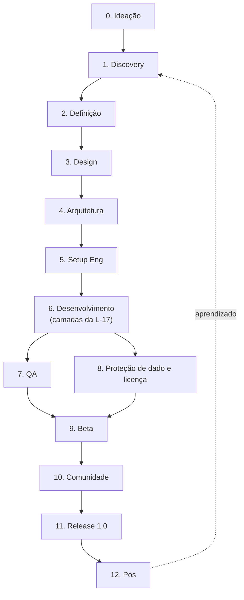

# Pipeline: Da Ideia ao Release 1.0 do GusWorld

> Fases do pipeline aplicáveis a um **jogo FOSS single-player offline** (LEI ZERO do `GODS_LAWS.md`: liga só em GlintFx e no sistema operacional). Sem backend, sem API, sem mobile, sem conta de usuário, sem monetização. Ancorado na **L-10**: `main` só orquestra; C-level audita e arquiteta sempre com modelo `fable`; agente operacional implementa sempre com `sonnet`. Hub: `Standards.md`.

---

## Visão geral do pipeline

Cada fase tem loop interno (uma descoberta volta ao Discovery, um bug volta ao Dev). O pipeline é iterativo dentro de cada fase, sequencial entre macro-fases.

### Mapa fase, C-level e agent

| Fase | C-level (`fable`) | Agents operacionais (`sonnet`) |
|---|---|---|
| 0. Ideação | Celso (CEO) | - (resolvida: `inicial.md` + `GODS_LAWS.md`) |
| 1. Discovery | Caetano (CTO) | `software-architect` (canon já existe em `docs/narrative/`) |
| 2. Definição | Caetano (CTO) | `software-architect` |
| 3. Design | Caetano (CTO) | - (interface só nasce com o GlintFx, L-27) |
| 4. Arquitetura | Caetano (CTO) | `software-architect`, `security-engineer` |
| 5. Setup Eng | Caetano (CTO) | `devops-sre`, `tech-lead` |
| 6. Desenvolvimento | Caetano (CTO) | `backend-engineer` (C++23) |
| 7. QA | Caetano (CTO) | `qa-engineer` |
| 8. Proteção de dado e licença | Narciso (CISO) + Cláudio (CLO) | `security-engineer`, `compliance-legal` |
| 9. Beta | Caetano (CTO) | `qa-engineer`, `technical-writer` |
| 10. Comunidade | Celso (CEO) | `technical-writer` (comunicação via bus, L-07) |
| 11. Release 1.0 | Celso (CEO) coordena | `devops-sre`, `tech-lead`, `qa-engineer` |
| 12. Pós | Caetano (CTO) | `qa-engineer`, `technical-writer` |

Antes de iniciar uma fase nova, o Cósimo (Chief of Staff) confirma que ela ainda faz sentido no porte do projeto; C-level sem trabalho real fica dormente (ver `ORG.md` secao 2).

---

## Fase 0: Ideação

Já concluída. A ideia, a hipótese de valor e o escopo do MVP estão no `inicial.md` (documento fundador, 28 itens) e nas leis do `GODS_LAWS.md`. Não se reabre sem o líder.

---

## Fase 1: Discovery

Para um jogo FOSS de autor, discovery não é pesquisa de mercado: é o **canon já escrito**. O corpus em `docs/narrative/`, `docs/design/`, `sinopse.md`, `CHARS.md` e `PLACES.md` é o insumo (L-01: vale para lore e design, não para código). Onde o canon contradiz uma lei vigente, o trabalho que depende dele **para** até o líder atualizar o canon (L-13).

**Entregável:** lista de contradições de canon abertas (ver L-13), atualizada conforme aparecem.

---

## Fase 2: Definição

O equivalente de PRD é a soma de `inicial.md` + `GODS_LAWS.md` + os documentos de design em `docs/design/`. Escopo do "MVP": núcleo de regra de jogo jogável por replay determinístico (L-17), antes mesmo de existir tela (L-06).

**Métricas de sucesso não são de aquisição/retenção** (não há usuário externo nem telemetria, L-08): são de **qualidade técnica**, os cinco portões da L-19, e de fidelidade ao canon.

---

## Fase 3: Design (jogo, não UI)

Design de sistema de jogo (combate, deck, mapa, progressão) deriva da prosa do canon (L-01) e das mecânicas em `docs/design/mecanicas/`. **Design de interface não é escrito ainda**: nenhuma marcação, folha de estilo ou tela piloto nasce antes de o GlintFx traduzir marcação (L-27). Perspectiva fixada: 3/4 top-down, quatro direções cardeais, câmera que não gira (L-26).

---

## Fase 4: Arquitetura Técnica

**Stack:** C++23 (L-03), zero dependência além do GlintFx e do sistema operacional (LEI ZERO).

**Padrão arquitetural:** espinha de cinco camadas com dependência só para baixo e gate de CI (`core/ → content/ → domain/ → app/ → present/`), núcleo determinístico por comando e evento (L-17). Nada de monólito (L-04), nada de dublê de plataforma (L-05).

**Modelagem de dado:** POCOs de domínio, serializados em envelope binário próprio, nunca texto (L-18, L-25).

**Segurança by design:** Narciso (CISO) desenha a proteção de save/config/mapa/catálogo (L-25); primitivas criptográficas vêm só do GlintFx.

**ADRs:** decisão de arquitetura registrada como lei no `GODS_LAWS.md` quando vem do líder; documento técnico de suporte fica em `docs/design/`.

---

## Fase 5: Setup de Engenharia

**Repositório:** `git`, Conventional Commits, mensagem em pt-br (L-22). `.gitignore`/`.gitattributes` escritos antes do primeiro commit (L-15): `resources/livros/` e `resources/glb/` fora do git, Git LFS para o resto do binário pesado.

**CI:** matriz de cinco plataformas desde o primeiro commit (L-09, L-20): Fedora 44 pinado (primário), Ubuntu, Arch, CachyOS, Windows. Fundação de build nasce legitimamente sem TDD; a partir do primeiro módulo de comportamento, não há mais essa saída (L-19, L-20).

**Observabilidade:** não aplicável (sem serviço em produção, sem telemetria).

---

## Fase 6: Desenvolvimento

Sem trilhas frontend/backend/mobile: **uma trilha só**, organizada pelas cinco camadas da L-17. Núcleo de regra (`core/`, `content/`, `domain/`) nasce primeiro, em TDD estrito (L-06, L-19); `app/` e `present/` só quando o GlintFx tiver janela, contexto gráfico, entrada e texto.

**Consequência assumida (L-06):** enquanto isso, o jogo não roda, não tem tela, não tem demo. O que existe é suíte de teste verde e núcleo provado. Relatar progresso visual inexistente é falta grave.

**Agent:** `backend-engineer` (C++23), sempre `sonnet`, sob orquestração de Caetano (CTO, `fable`).

---

## Fase 7: QA e Testes

TDD estrito a partir do primeiro módulo com comportamento (L-19): vermelho, verde, refatorar, sem pular etapa. Suíte de replay determinístico (semente + comandos reproduz o mesmo estado, L-17) como teste permanente. Detalhe completo em `TESTES.md`.

**Sem meta numérica de cobertura** (L-19): cobertura é consequência do TDD, não alvo.

---

## Fase 8: Proteção de Dado e Licença

Substitui "Segurança e Compliance" genérico: não há LGPD/GDPR/HIPAA aplicável (sem dado de usuário coletado, jogo offline, L-08). O que existe:

- **Proteção de save/config/mapa/catálogo** (L-18, L-25): envelope binário, cifra autenticada, validador semântico, sem prometer "impossível editar".
- **Licenciamento** (L-08): código AGPL-3.0-or-later com ressalva de uso offline; assets e lore com todos os direitos reservados; marcação REUSE/SPDX desde o primeiro commit.

**Liderança:** Narciso (CISO) na proteção de dado, Cláudio (CLO) no licenciamento, os dois sempre `fable`.

---

## Fase 9: Beta

Playtesting interno (o próprio líder e, quando aplicável, o filho dele como "Gus Dragon", L-16) substitui o beta fechado de usuários externos. Feedback do Gus Dragon chega pelo bus (L-07), nunca por canal de suporte comercial.

**Documentação para o jogador:** `README` com a ressalva de uso offline (L-08), changelog público por release (L-23).

---

## Fase 10: Comunidade

Substitui GTM comercial: sem pricing, sem funil pago, sem ASO. O que existe é comunicação simples de projeto FOSS (release notes no GitHub, resposta a issue) e o pipe de ideia do Gus Dragon (L-07: absorver, ack automático, discutir viabilidade com o líder, postar resultado honesto, arquivar).

---

## Fase 11: Release 1.0

**Versionamento:** `vA.B.C.D`, mesma convenção do GlintFx (L-23). Tag e release exigem aval explícito do líder no contexto, sempre (L-23).

Detalhe completo do checklist de release irreversível em `DEPLOY_CHECKLIST.md`.

**Liderança:** Celso (CEO) coordena o go/no-go; Caetano (CTO) e o `internal-auditor` confirmam que os portões da L-19 e o dossiê de auditoria (`AUDITORIAS.md`) estão fechados antes da tag.

---

## Fase 12: Pós-Lançamento

Estabilização por bug reportado (via bus com Gus Dragon ou issue pública), sem hypercare de produção porque não há serviço rodando. Planejamento do próximo `A.B` com o líder. Auditoria periódica conforme `AUDITORIAS.md`.

---

## Anti-padrões que este pipeline recusa

1. Escrever camada `present/` antes do GlintFx existir (L-06, L-27).
2. Dublê de plataforma: mock, stub ou `#ifdef` fingindo o GlintFx (L-05).
3. Meta numérica de cobertura de teste (L-19).
4. Prometer "impossível editar" em comunicação pública (L-25).
5. Aplicar pipeline comercial (GTM pago, LGPD, mobile store) a um jogo FOSS single-player sem esses domínios.
6. Sobre-escalar a constelação: C-level sem trabalho real neste projeto fica dormente (`ORG.md` secao 2), nunca ativado por hábito.
